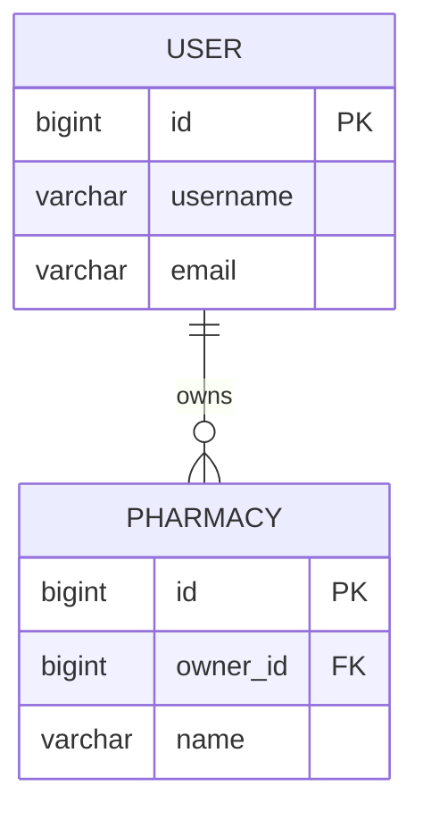

# 명세서 작성 도우미 스킬

API 명세서, 데이터베이스 스키마, 화면 명세서 작성을 도와주고, 백엔드/프론트엔드 코드와 동기화된 문서를 생성합니다.

## 작업 수행

### 1. API 명세서 작성

**백엔드 코드 분석:**
- `/mnt/c/Dev/repo/pico_friends_be/src/main/java/mall/pico_friends_api/controller/` 컨트롤러 분석
- Spring annotations (`@GetMapping`, `@PostMapping` 등) 추출
- Request/Response DTO 구조 파싱
- Swagger annotations (`@Operation`, `@ApiResponse`) 확인

**명세서 생성:**
```markdown
## [엔드포인트명]

### 기본 정보
- **Method**: GET/POST/PUT/DELETE
- **Path**: `/api/xxx`
- **권한**: ROLE_USER / ROLE_ADMIN
- **설명**: ...

### Request

#### Headers
| Name | Type | Required | Description |
|------|------|----------|-------------|
| Authorization | String | Yes | Bearer {token} |

#### Parameters
| Name | Type | Required | Description |
|------|------|----------|-------------|
| id | Long | Yes | ... |

#### Body
\`\`\`json
{
  "field": "value"
}
\`\`\`

### Response

#### Success (200 OK)
\`\`\`json
{
  "data": {...}
}
\`\`\`

#### Error (400/401/404/500)
\`\`\`json
{
  "error": "message"
}
\`\`\`
```

### 2. 데이터베이스 스키마 문서화

**DB 분석:**
- `/mnt/c/Dev/repo/pico_friends_be/src/main/resources/db/migration/` SQL 스크립트 파싱
- JPA Entity 클래스 분석 (`@Entity`, `@Table`, `@Column`)
- 관계 매핑 확인 (`@OneToMany`, `@ManyToOne`, `@ManyToMany`)

**ERD 생성 (Mermaid):**


**테이블 명세:**
```markdown
## t_user

### 컬럼
| Column | Type | Null | Key | Default | Description |
|--------|------|------|-----|---------|-------------|
| id | bigint | NO | PRI | auto | 사용자 ID |
| username | varchar(50) | NO | UNI | - | 사용자명 |

### 인덱스
- PRIMARY KEY (id)
- UNIQUE KEY uk_username (username)

### 외래키
- fk_user_role: user_role_id → t_user_role(id)
```

### 3. 화면 명세서 작성

**프론트엔드 코드 분석:**
- `/mnt/c/Dev/REpo/pico_friends_fe/src/app/` 페이지 구조 분석
- 컴포넌트 props 및 state 파싱
- API 호출 엔드포인트 추출 (`lib/api/`)

**화면 명세 생성:**
```markdown
## [PF-010] 로그인 화면

### 화면 정보
- **화면 ID**: PF-010
- **화면명**: 로그인
- **접근 권한**: Public
- **경로**: `/login`

### UI 컴포넌트
- CC-LOGIN (로그인 폼)
- CC-BUTTON (로그인 버튼)
- CC-INPUT (아이디/비밀번호)

### 상태 관리
- Zustand Store: `useAuthStore`
- React Query: `useLogin` hook

### API 연동
- POST `/api/auth/login`
- Request: `{ username, password }`
- Response: `{ accessToken, refreshToken }`

### 화면 흐름
1. 사용자 입력 (아이디/비밀번호)
2. 유효성 검증 (Zod schema)
3. API 호출
4. 성공 → 토큰 저장 → `/tasks` 리다이렉트
5. 실패 → 에러 토스트 표시
```

### 4. 코드 동기화 검증

**검증 항목:**
1. API 명세서 ↔ 백엔드 컨트롤러
2. API 명세서 ↔ 프론트엔드 API 클라이언트
3. DB 스키마 ↔ JPA Entity
4. 화면 명세서 ↔ Next.js 페이지

**불일치 리포트:**
```markdown
## 동기화 검증 결과

### ⚠️ 불일치 발견
1. **API 명세서 vs 백엔드**
   - 명세서: `GET /api/users/{id}`
   - 실제 코드: `GET /api/members/{id}`
   - 수정 필요: 명세서 또는 코드

2. **DB 스키마 vs Entity**
   - 스키마: `created_at TIMESTAMP`
   - Entity: `@Column(name = "createdAt")` (camelCase)
   - 권장: 스네이크 케이스로 통일
```

## 참조 파일

- API 명세서: `docs_new/05_api_specification.md`
- DB 스키마: `docs_new/04_database_schema.md`
- 화면 명세서: `docs_new/01_screen_picofriends.md`, `docs_new/02_screen_admin.md`
- 공통 컴포넌트: `docs_new/00_common_components.md`

## 사용 예시

- "AuthController의 API 명세서 작성해줘"
- "t_pico_friends_member 테이블 명세서 업데이트"
- "로그인 화면 명세서 작성 (PF-010)"
- "API 명세서와 백엔드 코드 동기화 확인"
