# 개발 작업 워크플로우 스킬

개발 작업의 전체 워크플로우를 자동화합니다.

**이 스킬은 atlassian-project-manager agent를 사용합니다.**

## 작업 수행

### 워크플로우: Jira → Git → 코드 → 커밋 → PR → Jira 업데이트

```mermaid
graph LR
    A[Jira 이슈 선택] --> B[Git 브랜치 생성]
    B --> C[Jira 상태: In Progress]
    C --> D[코드 작성]
    D --> E[테스트 실행]
    E --> F[Git 커밋]
    F --> G[Pull Request 생성]
    G --> H[Jira 상태: Done]
    H --> I[Confluence 개발 로그]
```



### 1. Jira 이슈 선택

**이슈 조회:**
```markdown
## 작업할 이슈 선택

### 내게 할당된 To Do 이슈 (5개)

1. **PF-44**: 아이콘 버튼 컴포넌트 (3 SP)
   - Epic: PF-3 (공통 컴포넌트)
   - Phase: 3
   - 예상 소요: 2일

2. **PF-52**: 로그인 세션 타임아웃 개선 (5 SP)
   - Epic: PF-4 (인증 시스템)
   - Priority: High
   - 예상 소요: 3일

3. **PF-54**: 약국 상세 화면 (8 SP)
   - Epic: PF-5 (화면 구현)
   - Phase: 2
   - 예상 소요: 4일

**선택**: PF-44 (아이콘 버튼 컴포넌트)
```

### 2. Git 브랜치 생성

**브랜치 네이밍 컨벤션:**
- Feature: `feature/PF-44-icon-button-component`
- Bug Fix: `fix/PF-45-login-error-message`
- Hotfix: `hotfix/PF-46-critical-security-fix`

**브랜치 생성:**
```bash
# 현재 브랜치 확인
git branch --show-current
# Output: master

# 최신 코드 pull
git pull origin master

# 새 브랜치 생성 및 체크아웃
git checkout -b feature/PF-44-icon-button-component

# 브랜치 푸시 (upstream 설정)
git push -u origin feature/PF-44-icon-button-component
```

**결과:**
```markdown
✅ Git 브랜치 생성 완료
- **브랜치명**: feature/PF-44-icon-button-component
- **Base**: master (커밋: xyz789abc)
- **Upstream**: origin/feature/PF-44-icon-button-component
```

### 3. Jira 이슈 상태 변경

**트랜지션: To Do → In Progress**
```markdown
## PF-44 상태 변경

### 변경 전
- **상태**: To Do
- **담당자**: John Doe
- **Sprint**: Sprint 2

### 변경 후
- **상태**: In Progress
- **시작 시간**: 2025-10-30 15:45:00
- **코멘트**: "브랜치 생성 완료. 아이콘 라이브러리 lucide-react 선정. 개발 시작."

### Jira 알림
✅ 담당자(John Doe)에게 이메일 발송
✅ Epic 담당자(Tech Lead)에게 알림
```

### 4. 코드 작성 가이드

**작업 계획:**
```markdown
## PF-44 개발 계획

### 1. 컴포넌트 파일 구조
\`\`\`
src/components/common/IconButton/
├── IconButton.tsx          # 메인 컴포넌트
├── IconButton.module.css   # 스타일
├── IconButton.stories.tsx  # Storybook
├── IconButton.test.tsx     # 단위 테스트
└── index.ts                # Export
\`\`\`

### 2. Props 인터페이스
\`\`\`typescript
interface IconButtonProps {
  icon: LucideIcon;
  onClick: () => void;
  variant?: 'default' | 'primary' | 'secondary' | 'ghost';
  size?: 'sm' | 'md' | 'lg';
  disabled?: boolean;
  ariaLabel: string;
}
\`\`\`

### 3. 구현 체크리스트
- [ ] IconButton 컴포넌트 작성
- [ ] CVA로 variant/size 스타일 정의
- [ ] 접근성 (aria-label, keyboard 지원)
- [ ] Storybook 스토리 작성
- [ ] 단위 테스트 (Vitest)
- [ ] 타입 체크 통과
- [ ] 린트 통과
```

### 5. 테스트 실행

**자동 테스트:**
```bash
# 타입 체크
npm run type-check

# 린트
npm run lint

# 단위 테스트
npm run test -- IconButton

# 테스트 커버리지
npm run test:coverage -- IconButton
```

**테스트 결과:**
```markdown
## 테스트 결과

### 타입 체크 ✅
No type errors found.

### 린트 ✅
No linting errors or warnings.

### 단위 테스트 ✅
\`\`\`
 PASS  src/components/common/IconButton/IconButton.test.tsx
  IconButton
    ✓ renders with icon (15ms)
    ✓ calls onClick when clicked (8ms)
    ✓ applies correct variant styles (5ms)
    ✓ applies correct size styles (4ms)
    ✓ disables when disabled prop is true (6ms)
    ✓ has correct aria-label (3ms)

Test Suites: 1 passed, 1 total
Tests:       6 passed, 6 total
Time:        2.145s
\`\`\`

### 커버리지 ✅
- **Statements**: 100%
- **Branches**: 100%
- **Functions**: 100%
- **Lines**: 100%
```

### 6. Git 커밋

**Conventional Commits 형식:**
```bash
git add src/components/common/IconButton/

git commit -m "$(cat <<'EOF'
feat(component): add IconButton component (PF-44)

- Implement IconButton with lucide-react
- Support 4 variants (default, primary, secondary, ghost)
- Support 3 sizes (sm, md, lg)
- Add accessibility features (aria-label, keyboard)
- Add Storybook stories
- Add unit tests (100% coverage)

Component specs:
- Props: icon, onClick, variant, size, disabled, ariaLabel
- Styling: CVA (class-variance-authority)
- Testing: Vitest + @testing-library/react

Related: PF-44
EOF
)"
```

**커밋 결과:**
```markdown
✅ Git 커밋 완료
- **커밋 해시**: def456ghi
- **커밋 메시지**: feat(component): add IconButton component (PF-44)
- **변경 파일**: 5개
- **추가**: +234 lines
```

### 7. Pull Request 생성

**PR 제목 및 본문 생성:**
```bash
git push origin feature/PF-44-icon-button-component

gh pr create --title "[PF-44] Add IconButton component" --body "$(cat <<'EOF'
## Summary
아이콘 버튼 공통 컴포넌트를 추가합니다.

### Changes
- ✨ IconButton 컴포넌트 구현
- 📝 Storybook 스토리 추가
- ✅ 단위 테스트 (100% 커버리지)
- 🎨 4가지 variants, 3가지 sizes 지원
- ♿ 접근성 개선 (aria-label, keyboard)

### Related Issues
- Jira: [PF-44](https://picoinnov.atlassian.net/browse/PF-44)
- Epic: [PF-3](https://picoinnov.atlassian.net/browse/PF-3) - FE 공통 컴포넌트 개발

### Screenshots


### Test Plan
- [x] 단위 테스트 통과 (6/6)
- [x] 타입 체크 통과
- [x] 린트 통과
- [x] Storybook 확인
- [ ] QA 테스트 (담당: Jane Smith)

### Breaking Changes
없음

### Dependencies
- lucide-react (이미 설치됨)

### Checklist
- [x] 코드 작성
- [x] 테스트 작성
- [x] 문서 작성 (Storybook)
- [ ] 코드 리뷰 요청
- [ ] QA 승인
- [ ] Merge to master
EOF
)"
```

**PR 생성 결과:**
```markdown
✅ Pull Request 생성 완료
- **PR 번호**: #123
- **제목**: [PF-44] Add IconButton component
- **URL**: https://github.com/pico-innovation/pico-friends-fe/pull/123
- **Reviewers**: Tech Lead, Senior Dev
- **Labels**: component, phase-3, frontend
```

### 8. Jira 이슈 업데이트

**PR 링크 추가 및 코멘트:**
```markdown
## PF-44 업데이트

### 1. Pull Request 링크 추가
✅ Remote Issue Link 추가:
- **URL**: https://github.com/pico-innovation/pico-friends-fe/pull/123
- **Title**: PR #123: Add IconButton component

### 2. 코멘트 추가
✅ 코멘트:
> Pull Request 생성 완료
>
> - PR: #123
> - 브랜치: feature/PF-44-icon-button-component
> - 커밋: def456ghi
> - 변경: +234 lines (5 files)
> - 테스트: 6/6 passed (100% coverage)
> - Reviewers: Tech Lead, Senior Dev
>
> 📎 [PR 보기](https://github.com/pico-innovation/pico-friends-fe/pull/123)
> 📎 [Storybook](http://localhost:6006/?path=/story/pico-common-iconbutton)

### 3. 상태 변경 (선택)
- **현재**: In Progress
- **다음**: Code Review (PR 머지 전)
- **최종**: Done (PR 머지 후)

**선택**: 현재는 In Progress 유지, PR 머지 시 자동으로 Done으로 변경
```

### 9. Confluence 개발 로그 작성

**개발 로그 페이지 업데이트:**
```markdown
## Confluence 개발 로그

### 페이지: 개발 로그 - 2025년 10월

**추가 항목:**

---

### 2025-10-30 - IconButton 컴포넌트 (PF-44)

**작업 내용**
아이콘 버튼 공통 컴포넌트를 추가했습니다.

**구현 사항**
- 컴포넌트: `CC-ICON-BUTTON`
- Props: icon, onClick, variant, size, disabled, ariaLabel
- Variants: default, primary, secondary, ghost
- Sizes: sm (32px), md (40px), lg (48px)
- 아이콘 라이브러리: lucide-react

**기술 스택**
- React 19
- TypeScript
- CVA (class-variance-authority)
- Tailwind CSS

**테스트**
- 단위 테스트: 6개 (100% 커버리지)
- Storybook: 12개 스토리

**참고 링크**
- Jira: [PF-44](https://picoinnov.atlassian.net/browse/PF-44)
- PR: [#123](https://github.com/pico-innovation/pico-friends-fe/pull/123)
- Storybook: [IconButton](http://localhost:6006/?path=/story/pico-common-iconbutton)

**작성자**: John Doe

---

✅ Confluence 개발 로그 업데이트 완료
```

### 10. 워크플로우 요약

**전체 워크플로우 리포트:**
```markdown
# 개발 워크플로우 실행 결과

## 📊 요약
- **이슈**: PF-44 (아이콘 버튼 컴포넌트)
- **실행 시간**: 2025-10-30 15:45:00 ~ 17:30:00
- **소요 시간**: 1시간 45분
- **상태**: ✅ 성공

## 단계별 결과

### 1. Jira 이슈 선택 ✅
- 이슈: PF-44
- Epic: PF-3

### 2. Git 브랜치 생성 ✅
- 브랜치: feature/PF-44-icon-button-component

### 3. Jira 상태 변경 ✅
- To Do → In Progress

### 4. 코드 작성 ✅
- 파일: 5개 (+234 lines)
- 컴포넌트: IconButton

### 5. 테스트 실행 ✅
- 단위 테스트: 6/6 passed
- 커버리지: 100%

### 6. Git 커밋 ✅
- 커밋: def456ghi

### 7. Pull Request 생성 ✅
- PR: #123

### 8. Jira 업데이트 ✅
- PR 링크 추가
- 코멘트 작성

### 9. Confluence 로그 ✅
- 개발 로그 작성

## 다음 단계

- [ ] 코드 리뷰 대기 (Reviewers: 2명)
- [ ] QA 테스트 요청
- [ ] PR 승인 후 Merge
- [ ] Jira 상태: In Progress → Done
- [ ] 브랜치 삭제
```

## 사용 시나리오

### 시나리오 1: 새 기능 개발 시작
```markdown
**사용자**: "PF-44 작업 시작해줘"

**워크플로우**:
1. PF-44 이슈 조회
2. 브랜치 생성: feature/PF-44-icon-button-component
3. Jira 상태: To Do → In Progress
4. 개발 가이드 제시

**결과**: "✅ PF-44 작업 준비 완료. 브랜치 생성되고 Jira 상태 변경됨."
```

### 시나리오 2: 작업 완료 및 PR 생성
```markdown
**사용자**: "PF-44 개발 완료했어. PR 생성해줘"

**워크플로우**:
1. 테스트 실행 (타입/린트/단위)
2. Git 커밋 생성
3. PR 생성
4. Jira 업데이트 (PR 링크, 코멘트)
5. Confluence 개발 로그 작성

**결과**: "✅ PR #123 생성 완료. Jira와 Confluence 업데이트됨."
```

### 시나리오 3: 긴급 버그 수정
```markdown
**사용자**: "PF-60 리더보드 정렬 버그 긴급 수정"

**워크플로우**:
1. Hotfix 브랜치 생성: hotfix/PF-60-leaderboard-sort
2. Jira 상태: High Priority
3. 코드 수정
4. 긴급 PR 생성
5. 리뷰어에게 즉시 알림

**결과**: "🚨 긴급 Hotfix PR #124 생성. 리뷰어에게 알림 발송됨."
```

## 설정

**워크플로우 설정 파일: `.claude/workflow-dev.json`**
```json
{
  "git": {
    "branchPrefix": {
      "feature": "feature/",
      "bugfix": "fix/",
      "hotfix": "hotfix/"
    },
    "commitConvention": "conventional-commits",
    "autoPush": true
  },
  "jira": {
    "autoTransition": true,
    "addPRLink": true,
    "addComments": true
  },
  "pr": {
    "autoAssignReviewers": true,
    "defaultReviewers": ["tech-lead", "senior-dev"],
    "addLabels": true,
    "templatePath": ".github/PULL_REQUEST_TEMPLATE.md"
  },
  "confluence": {
    "addDevLog": true,
    "devLogPageId": "123456"
  },
  "notifications": {
    "slack": {
      "enabled": false,
      "channel": "#picofriends-dev"
    }
  }
}
```

## 사용 예시

- "PF-44 작업 시작"
- "PF-52 개발 완료, PR 생성"
- "PF-60 긴급 버그 수정 워크플로우"
- "현재 Sprint의 내 작업 목록 보여줘"
- "개발 워크플로우 자동화 설정"

## 참고

**사용되는 스킬:**
- `/jira-board`: 보드 조회 및 이슈 관리
- `/jira-sync`: Jira 이슈 동기화
- `/confluence-doc`: Confluence 문서 작성
