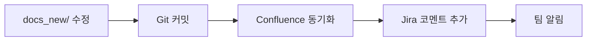

# 문서 작업 워크플로우 스킬

문서 프로젝트의 전체 워크플로우를 자동화합니다.

**이 스킬은 atlassian-project-manager agent를 사용합니다.**

## 작업 수행

### 워크플로우: 문서 업데이트 → Git → Confluence → Jira



### 1. 문서 수정 감지

**파일 변경 감지:**
```bash
git status --porcelain docs_new/
```

**변경된 파일 분석:**
```markdown
## 감지된 변경사항

### 수정된 파일 (3개)
1. docs_new/05_api_specification.md
   - 변경 내용: 엔드포인트 3개 추가
   - 관련 이슈: PF-52, PF-54

2. docs_new/00_common_components.md
   - 변경 내용: CC-ICON-BUTTON 컴포넌트 추가
   - 관련 이슈: PF-44

3. docs_new/01_screen_picofriends.md
   - 변경 내용: PF-055 화면 설명 보강
   - 관련 이슈: PF-55

### 새로운 파일 (1개)
1. docs_new/07_deployment_guide.md
   - 내용: 배포 가이드 문서 신규 작성
   - 관련 이슈: (없음)
```

### 2. Git 커밋 생성

**커밋 메시지 자동 생성:**
```bash
# 변경사항 스테이징
git add docs_new/05_api_specification.md
git add docs_new/00_common_components.md
git add docs_new/01_screen_picofriends.md
git add docs_new/07_deployment_guide.md

# 커밋
git commit -m "$(cat <<'EOF'
docs: 화면설계서 v1.6 업데이트

- API 명세서: 엔드포인트 3개 추가 (PF-52, PF-54)
- 공통 컴포넌트: CC-ICON-BUTTON 추가 (PF-44)
- 피코프렌즈 화면: PF-055 설명 보강 (PF-55)
- 배포 가이드: 신규 작성

Related: PF-44, PF-52, PF-54, PF-55
EOF
)"
```

**커밋 결과:**
```markdown
✅ Git 커밋 완료
- **커밋 해시**: abc123def
- **커밋 메시지**: docs: 화면설계서 v1.6 업데이트
- **변경 파일**: 4개
- **추가**: +156 lines
- **삭제**: -23 lines
```

### 3. Confluence 자동 동기화

**양방향 동기화 실행:**
```markdown
## Confluence 동기화

### 1단계: 변경사항 확인
✅ 로컬 파일 4개 변경 감지
✅ Confluence 페이지 매핑 확인

### 2단계: Confluence 업데이트
🔄 05_api_specification.md → API 명세서 페이지 (v6)
🔄 00_common_components.md → 공통 컴포넌트 명세 페이지 (v7)
🔄 01_screen_picofriends.md → 피코프렌즈 화면설계서 페이지 (v8)
🆕 07_deployment_guide.md → 배포 가이드 페이지 (신규)

### 3단계: 이미지 첨부
✅ 이미지 2개 업로드 완료

### 4단계: 페이지 라벨 추가
✅ version-1.6, updated-2025-10-30 라벨 추가

## 동기화 완료 ✅
- **업데이트**: 3개 페이지
- **신규**: 1개 페이지
- **소요 시간**: 45초
```

### 4. Jira 이슈 업데이트

**관련 이슈에 코멘트 추가:**
```markdown
## Jira 이슈 업데이트

### PF-44: 아이콘 버튼 컴포넌트
✅ 코멘트 추가:
> 문서 업데이트: CC-ICON-BUTTON 컴포넌트 명세 추가
>
> - 스펙 문서: [공통 컴포넌트 명세](https://picoinnov.atlassian.net/wiki/spaces/PICO/pages/123456)
> - 변경 커밋: abc123def
> - 변경 일시: 2025-10-30 15:30

### PF-52: 로그인 세션 타임아웃 개선
✅ 코멘트 추가:
> 문서 업데이트: API 명세서에 세션 타임아웃 엔드포인트 추가
>
> - API 문서: [API 명세서](https://picoinnov.atlassian.net/wiki/spaces/PICO/pages/789012)
> - 엔드포인트: POST /api/auth/extend-session

### PF-54, PF-55
✅ 유사하게 코멘트 추가 완료

## Jira 업데이트 완료 ✅
- **업데이트 이슈**: 4개
- **코멘트 추가**: 4개
```

### 5. 팀 알림 (선택)

**Confluence 공간 알림:**
```markdown
## 팀 알림

### Confluence Space 알림
✅ PICO Space 구독자에게 이메일 알림 발송
- 수신자: 팀원 5명
- 제목: "문서 업데이트: 화면설계서 v1.6"
- 내용:
  > 다음 문서가 업데이트되었습니다:
  > - API 명세서 (v6)
  > - 공통 컴포넌트 명세 (v7)
  > - 피코프렌즈 화면설계서 (v8)
  > - 배포 가이드 (신규)
  >
  > 변경 사항: https://picoinnov.atlassian.net/wiki/spaces/PICO/overview

### Slack 알림 (선택)
📬 #picofriends-dev 채널에 메시지 발송:
> 📝 **문서 업데이트**
> 화면설계서 v1.6이 업데이트되었습니다.
>
> 변경 파일:
> - API 명세서 (엔드포인트 3개 추가)
> - 공통 컴포넌트 (CC-ICON-BUTTON 추가)
> - 피코프렌즈 화면 (PF-055 보강)
> - 배포 가이드 (신규)
>
> 📎 [Confluence 보기](https://picoinnov.atlassian.net/wiki/spaces/PICO/overview)
> 📎 [Git 커밋](https://github.com/pico-innovation/docs/commit/abc123def)
```

### 6. 워크플로우 요약

**전체 워크플로우 리포트:**
```markdown
# 문서 워크플로우 실행 결과

## 📊 요약
- **실행 시간**: 2025-10-30 15:30:00
- **소요 시간**: 1분 30초
- **상태**: ✅ 성공

## 단계별 결과

### 1. 파일 변경 감지 ✅
- 수정: 3개
- 신규: 1개

### 2. Git 커밋 ✅
- 커밋 해시: abc123def
- 변경: +156/-23 lines

### 3. Confluence 동기화 ✅
- 업데이트: 3개 페이지
- 신규: 1개 페이지

### 4. Jira 업데이트 ✅
- 코멘트: 4개 이슈

### 5. 팀 알림 ✅
- 이메일: 5명
- Slack: #picofriends-dev

## 다음 단계

- [ ] 팀원 리뷰 요청
- [ ] 백엔드/프론트엔드 코드 반영 확인
- [ ] 다음 릴리즈(v1.6.0) 준비
```

## 사용 시나리오

### 시나리오 1: 화면설계서 업데이트
```markdown
**사용자**: "화면설계서 v1.6 업데이트했어. Confluence랑 Jira 동기화해줘."

**워크플로우 실행**:
1. docs_new/ 변경사항 스캔
2. Git 커밋 생성
3. Confluence 페이지 업데이트
4. 관련 Jira 이슈에 코멘트
5. 팀 알림 발송

**결과**: "✅ 화면설계서 v1.6 업데이트 완료. Confluence 4개 페이지 동기화, Jira 4개 이슈 업데이트됨."
```

### 시나리오 2: API 명세서 수정
```markdown
**사용자**: "API 명세서에 엔드포인트 3개 추가했어."

**워크플로우 실행**:
1. 05_api_specification.md 변경 감지
2. 백엔드 코드와 일치 여부 확인
3. Swagger JSON 비교
4. Git 커밋
5. Confluence API 명세서 페이지 업데이트
6. Jira 이슈 코멘트

**결과**: "✅ API 명세서 업데이트 완료. 백엔드 코드와 일치함. Confluence 동기화 완료."
```

### 시나리오 3: 주간 문서 리뷰
```markdown
**사용자**: "이번 주 문서 변경사항 정리해서 리포트 생성해줘."

**워크플로우 실행**:
1. 최근 7일간 Git 로그 분석
2. 변경된 문서 목록 생성
3. Confluence 페이지 변경 이력 조회
4. Jira 관련 이슈 조회
5. 주간 리포트 생성 및 Confluence 발행

**결과**: "✅ 주간 문서 리포트 생성 완료. 12개 커밋, 8개 페이지 업데이트, 15개 이슈 연결됨."
```

## 설정

**워크플로우 설정 파일: `.claude/workflow-docs.json`**
```json
{
  "autoSync": {
    "enabled": true,
    "trigger": "git-commit",
    "conflictResolution": "prompt"
  },
  "confluence": {
    "spaceKey": "PICO",
    "notifyOnUpdate": true,
    "addVersionLabel": true
  },
  "jira": {
    "addComments": true,
    "updateLinkedIssues": true,
    "transitionOnComplete": false
  },
  "notifications": {
    "email": true,
    "slack": {
      "enabled": false,
      "channel": "#picofriends-dev"
    }
  }
}
```

## 사용 예시

- "docs_new/ 변경사항을 Confluence와 Jira에 동기화"
- "화면설계서 v1.6 업데이트 워크플로우 실행"
- "API 명세서 수정하고 팀에 알림"
- "이번 주 문서 변경사항 리포트"
- "문서 워크플로우 자동화 설정"

## 참고

**사용되는 스킬:**
- `/docs-sync`: 문서 일관성 검증
- `/spec-helper`: 명세서 작성 지원
- `/confluence-doc`: Confluence 업로드
- `/confluence-sync`: 양방향 동기화
- `/jira-sync`: Jira 이슈 동기화
- `/changelog`: 변경 이력 생성
