# PICOFriends 프로젝트 - Claude Code 가이드

> 이 문서는 Claude Code가 PICOFriends 프로젝트를 효율적으로 이해하고 작업하기 위한 종합 가이드입니다.

## 📋 목차

- [프로젝트 개요](#-프로젝트-개요)
- [저장소 구조](#-저장소-구조)
- [Claude Skills 가이드](#-claude-skills-가이드)
- [문서 구조](#-문서-구조)
- [개발 워크플로우](#-개발-워크플로우)
- [프로젝트 관리](#-프로젝트-관리)
- [Claude와 작업하기](#-claude와-작업하기)

---

## 🎯 프로젝트 개요

**PICOFriends**는 필드 워커(Field Worker)가 약국을 방문하고 관리하는 모바일 웹 애플리케이션입니다.

### 핵심 기능
- 🔐 **인증 시스템**: JWT 기반 로그인/회원가입, 승인 워크플로우
- 📋 **약국 관리**: 담당 약국 배정, 방문 현황 추적
- 📸 **방문 인증**: 사진 업로드, GPS 좌표 수집, 타임스탬프 기록
- 📝 **설문 시스템**: 동적 설문 폼, 다양한 질문 유형, JSONB 응답 저장
- 🏆 **리더보드**: 실시간 순위 시스템
- 👥 **관리자 기능**: 사용자/약국/설문 관리, 통계 대시보드

### 기술 스택 요약

```
┌─────────────────────────────────────────────────────────────┐
│                     PICOFriends 아키텍처                      │
├─────────────────────────────────────────────────────────────┤
│                                                               │
│  📱 Frontend (pico_friends_fe)                               │
│     - Next.js 15.1.6 (App Router)                            │
│     - React 19.0.0 + TypeScript                              │
│     - Tailwind CSS + Shadcn/ui                               │
│     - Zustand + TanStack Query                               │
│     - Port: 3000                                             │
│                                                               │
│  🔗 HTTP/REST API                                            │
│     │                                                         │
│  🖥️  Backend (pico_friends_be)                               │
│     - Spring Boot 3.3.5 + Java 21                            │
│     - Spring Security + JWT                                  │
│     - JPA + QueryDSL                                         │
│     - Port: 8080                                             │
│     │                                                         │
│     ├─── PostgreSQL 13.1+ (Primary DB)                       │
│     └─── Redis (Token Cache)                                 │
│                                                               │
│  📚 Documentation (pico_friends_works) - 이 저장소            │
│     - 기술 문서 (Markdown)                                    │
│     - 화면설계서 (PowerPoint)                                 │
│     - Claude Code Skills (15개)                              │
│     - Jira/Confluence 통합                                   │
│                                                               │
└─────────────────────────────────────────────────────────────┘
```

---

## 🗂️ 저장소 구조

PICOFriends는 3개의 독립된 Git 저장소로 구성됩니다:

### 1. **pico_friends_works** (현재 저장소)
**경로**: `/Users/bgb/Dev/Repo/pico_friends_works`
**역할**: 프로젝트 관리, 문서화, Claude 자동화

```
pico_friends_works/
├── .claude/
│   └── skills/              # 15개 Claude Code 스킬
├── docker/                  # 🐳 Docker 개발 환경
│   ├── docker-compose.yml  # Redis 컨테이너 설정
│   ├── DOCKER_SETUP.md     # Docker 사용 가이드
│   └── README.md           # Docker 디렉토리 개요
├── docs_new/                # 📖 기술 문서 (7개 MD 파일)
│   ├── README.md           # 프로젝트 개요
│   ├── 00_common_components.md
│   ├── 01_screen_picofriends.md
│   ├── 02_screen_admin.md
│   ├── 03_technical_architecture.md
│   ├── 04_database_schema.md
│   ├── 05_api_specification.md
│   └── 06_information_architecture.md
├── 화면설계서/              # 🎨 UI 디자인 (v1.1 ~ v1.6)
└── 피코프렌즈_v1.x/         # 프로토타입 파일
```

### 2. **pico_friends_fe** (프론트엔드)
**경로**: `/Users/bgb/Dev/Repo/pico_friends_fe`
**역할**: 사용자 인터페이스 (모바일 웹 + 관리자 웹)

👉 **상세 가이드**: [pico_friends_fe/CLAUDE.md](/Users/bgb/Dev/Repo/pico_friends_fe/CLAUDE.md)

### 3. **pico_friends_be** (백엔드)
**경로**: `/Users/bgb/Dev/Repo/pico_friends_be`
**역할**: REST API 서버, 비즈니스 로직, 데이터 관리

👉 **상세 가이드**: [pico_friends_be/CLAUDE.md](/Users/bgb/Dev/Repo/pico_friends_be/CLAUDE.md)

---

## 🛠️ Claude Skills 가이드

이 저장소에는 **15개의 커스텀 Claude Code 스킬**이 구축되어 있습니다. 이 스킬들은 문서화, 프로젝트 관리, 워크플로우 자동화를 위한 강력한 도구입니다.

### 📂 스킬 위치
모든 스킬은 [.claude/skills/](.claude/skills/) 디렉토리에 있습니다.

### 📚 스킬 카테고리

#### 1️⃣ **Atlassian 통합** (6개 스킬)

##### Jira 관리 (4개)

| 스킬 | 명령어 | 설명 |
|------|--------|------|
| **jira-sync** | `/jira-sync` | Jira 이슈와 로컬 문서 동기화 |
| **jira-create** | `/jira-create` | 빠른 Jira 이슈 생성 |
| **jira-report** | `/jira-report` | 프로젝트 진행 상황 리포트 생성 |
| **jira-board** | `/jira-board` | 스프린트 보드 현황 확인 |

##### Atlassian Agent (자동 실행)

| 스킬 | 자동 실행 조건 | 설명 |
|------|----------------|------|
| **atlassian-project-manager** | Jira 이슈 번호/링크, Confluence 링크 감지 시 | Jira 이슈 조회/생성/업데이트, Confluence 페이지 관리 (MCP 도구 활용) |

**Jira 프로젝트**: [PF Board](https://picoinnov.atlassian.net/jira/software/projects/PF/boards/5/timeline)

**사용 예시**:
```bash
# 현재 스프린트의 모든 이슈 동기화
/jira-sync

# 새로운 버그 이슈 생성
/jira-create "로그인 후 토큰 만료 에러" --type bug

# 주간 진행 상황 리포트
/jira-report --period week

# Atlassian Agent는 자동 실행됩니다
사용자: "PF-42 이슈 상태 확인해줘"
→ Claude가 자동으로 atlassian-project-manager Agent 실행
```

##### Confluence 관리 (1개)

| 스킬 | 명령어 | 설명 |
|------|--------|------|
| **confluence-sync** | `/confluence-sync` | Markdown 문서를 Confluence 페이지로 업로드 |

**사용 예시**:
```bash
# API 명세서를 Confluence에 업로드
/confluence-sync docs_new/05_api_specification.md
```

#### 2️⃣ **Git 워크플로우** (1개 스킬)

##### Git Commit Agent (자동 실행)

| 스킬 | 자동 실행 조건 | 설명 |
|------|----------------|------|
| **pico-git-commit** | Staged 파일 존재 시, "커밋" 키워드 감지 시 | Gitflow + Jira Smart Commit 통합 커밋 메시지 자동 생성 |

**사용 예시**:
```bash
# Agent는 자동 실행됩니다
사용자: "로그인 기능 구현 완료했어, 커밋해줘"
→ Claude가 자동으로 pico-git-commit Agent 실행
→ 브랜치명에서 이슈 키 추출 (예: feature/PF-33-login → PF-33)
→ Conventional Commits + Jira Smart Commit 형식으로 메시지 생성
→ 예: "PF-33 feat: 로그인 컴포넌트 구현 #done"
```

#### 3️⃣ **문서 자동화** (3개 스킬)

| 스킬 | 명령어 | 설명 |
|------|--------|------|
| **docs-sync** | `/docs-sync` | Markdown ↔ PPT ↔ Confluence 동기화 |
| **spec-helper** | `/spec-helper` | API/DB/화면 명세서 자동 생성 |
| **changelog** | `/changelog` | Git 커밋 기반 CHANGELOG.md 생성 |

**사용 예시**:
```bash
# 최신 화면설계서를 Markdown으로 변환
/docs-sync --from ppt --to markdown 화면설계서/251105_v1.6.pptx

# 백엔드 코드에서 API 명세서 자동 생성
/spec-helper --type api --source ../pico_friends_be

# 최근 10개 커밋으로 CHANGELOG 업데이트
/changelog --commits 10
```

#### 4️⃣ **워크플로우 자동화** (2개 스킬)

| 스킬 | 명령어 | 설명 |
|------|--------|------|
| **workflow-docs** | `/workflow-docs` | 문서화 워크플로우 (Jira → 작성 → Confluence) |
| **workflow-dev** | `/workflow-dev` | 개발 워크플로우 (Jira → 개발 → PR → 문서) |

**사용 예시**:
```bash
# API 명세서 작성 및 배포 워크플로우
/workflow-docs PF-25

# 기능 개발 풀 워크플로우 (이슈부터 배포까지)
/workflow-dev PF-30 --feature "방문 통계 대시보드"
```

#### 5️⃣ **릴리스 관리** (1개 스킬)

| 스킬 | 명령어 | 설명 |
|------|--------|------|
| **release-notes** | `/release-notes` | 릴리스 노트 자동 생성 (Jira + Git) |

**사용 예시**:
```bash
# v1.2.0 릴리스 노트 생성
/release-notes --version 1.2.0 --from v1.1.0 --to main
```

### 🎓 스킬 학습 가이드

스킬의 상세 사용법은 [.claude/skills/README.md](.claude/skills/README.md)를 참조하세요. 각 스킬 파일에도 구체적인 사용 예시가 포함되어 있습니다.

---

## 📖 문서 구조

### 핵심 기술 문서 (docs_new/)

| 파일 | 내용 | 크기 |
|------|------|------|
| [README.md](docs_new/README.md) | 프로젝트 개요 및 설정 가이드 | - |
| [00_common_components.md](docs_new/00_common_components.md) | 공통 UI 컴포넌트 명세 | 62KB |
| [01_screen_picofriends.md](docs_new/01_screen_picofriends.md) | 모바일 웹 화면 명세 | 16KB |
| [02_screen_admin.md](docs_new/02_screen_admin.md) | 관리자 웹 화면 명세 | 29KB |
| [03_technical_architecture.md](docs_new/03_technical_architecture.md) | 시스템 아키텍처 설계 | 23KB |
| [04_database_schema.md](docs_new/04_database_schema.md) | 데이터베이스 ERD 및 스키마 | 25KB |
| [05_api_specification.md](docs_new/05_api_specification.md) | REST API 엔드포인트 명세 | 19KB |
| [06_information_architecture.md](docs_new/06_information_architecture.md) | 정보 구조 및 플로우 다이어그램 | 20KB |

### 문서 작성 규칙

1. **Markdown 우선**: 모든 기술 문서는 Markdown으로 작성
2. **버전 관리**: PowerPoint 파일은 날짜+버전 포함 (예: `251105_v1.6.pptx`)
3. **동기화**: 주요 변경 시 `/docs-sync` 스킬로 포맷 간 동기화
4. **Confluence 배포**: 최종 승인 후 `/confluence-sync`로 배포

### 화면설계서 버전 히스토리

| 버전 | 날짜 | 주요 변경 사항 |
|------|------|----------------|
| v1.6 | 2025-11-05 | 최신 통합 버전 |
| v1.5 | 2025-10-30 | - |
| v1.4 | 2025-10-27 | - |
| v1.3 | 2025-10-21 | - |
| v1.2 | 2025-10-21 | - |
| v1.1 | 2025-10-15 | 초기 버전 |

📌 **최신 버전**: [화면설계서/251105_v1.6.pptx](화면설계서/251105_v1.6.pptx)

---

## 🔄 개발 워크플로우

### 표준 개발 프로세스

```mermaid
graph LR
    A[Jira 이슈 생성] --> B[브랜치 생성]
    B --> C[코드 개발]
    C --> D[로컬 테스트]
    D --> E[PR 생성]
    E --> F[코드 리뷰]
    F --> G{승인?}
    G -->|Yes| H[main 머지]
    G -->|No| C
    H --> I[문서 업데이트]
    I --> J[Jira 이슈 완료]
```



### 브랜치 전략

```
main (보호됨)
 └── feature/PF-XX-feature-name    # 기능 개발
 └── bugfix/PF-XX-bug-name          # 버그 수정
 └── hotfix/PF-XX-critical-fix      # 긴급 수정
 └── docs/PF-XX-doc-update          # 문서 업데이트
```

**네이밍 규칙**: `{type}/PF-{issue-number}-{short-description}`

### 커밋 메시지 컨벤션

```
<type>(<scope>): <subject>

[optional body]

[optional footer]
```

**타입**:
- `feat`: 새로운 기능
- `fix`: 버그 수정
- `docs`: 문서 변경
- `style`: 코드 포맷팅 (로직 변경 없음)
- `refactor`: 리팩토링
- `test`: 테스트 추가/수정
- `chore`: 빌드 프로세스, 도구 설정 등

**예시**:
```bash
feat(auth): PF-10 로그인 JWT 토큰 발급 기능 추가

- /api/auth/login 엔드포인트 구현
- Access Token (1시간) + Refresh Token (7일) 발급
- Redis에 Refresh Token 저장

Resolves: PF-10
```

### Claude 스킬 활용 워크플로우

#### 시나리오 1: 새로운 기능 개발

```bash
# 1. Jira 이슈 생성 및 동기화
/jira-create "약국 방문 통계 대시보드" --type story

# 2. 개발 워크플로우 시작 (자동으로 브랜치 생성, 개발 가이드 제공)
/workflow-dev PF-35 --feature "약국 방문 통계 대시보드"

# 3. 개발 완료 후 API 명세서 자동 생성
/spec-helper --type api --source ../pico_friends_be

# 4. CHANGELOG 업데이트
/changelog --since last-release

# 5. Confluence에 문서 배포
/confluence-sync docs_new/05_api_specification.md
```

#### 시나리오 2: 문서 작성 및 배포

```bash
# 1. 화면설계서 PPT를 Markdown으로 변환
/docs-sync --from ppt --to markdown 화면설계서/251105_v1.6.pptx

# 2. 문서 워크플로우로 Jira 이슈와 연결하여 작성
/workflow-docs PF-40 --doc-type "화면 명세서"

# 3. Confluence 배포
/confluence-sync docs_new/01_screen_picofriends.md
```

#### 시나리오 3: 스프린트 리뷰 준비

```bash
# 1. 현재 스프린트 진행 상황 확인
/jira-board

# 2. 주간 리포트 생성
/jira-report --period week

# 3. 릴리스 노트 준비
/release-notes --version 1.3.0 --from v1.2.0 --to main
```

---

## 🗂️ 프로젝트 관리

### Jira 프로젝트

**프로젝트 키**: `PF`
**보드 URL**: https://picoinnov.atlassian.net/jira/software/projects/PF/boards/5/timeline

**이슈 타입**:
- 📘 **Epic**: 대규모 기능 묶음
- 📗 **Story**: 사용자 스토리
- 📙 **Task**: 일반 작업
- 🐛 **Bug**: 버그
- 🎯 **Subtask**: 하위 작업

**워크플로우 상태**:
```
TODO → IN PROGRESS → IN REVIEW → DONE
              ↓
          BLOCKED
```

### 프로젝트 타임라인

현재 개발 중인 주요 Epic:
- **PF-010**: 사용자 인증 시스템 (로그인/회원가입)
- **PF-020**: 약국 관리 기능
- **PF-030**: 방문 인증 및 기록
- **PF-040**: 설문 시스템
- **PF-043**: 리더보드 및 통계

---

## 🤖 Claude와 작업하기

### Claude에게 작업 요청 시 제공할 정보

#### 1. **기능 개발 요청**

```
Jira 이슈: PF-XX
기능: [기능 설명]
관련 문서: docs_new/XX_xxx.md
영향 받는 저장소: [fe/be/both]
기술 스택: [Next.js/Spring Boot/PostgreSQL 등]
```

**예시**:
> Jira 이슈 PF-42에 대해 약국 방문 통계 대시보드를 개발해줘.
> - 관련 문서: docs_new/02_screen_admin.md (AS-030)
> - 영향: Frontend (pico_friends_fe), Backend (pico_friends_be)
> - 기술: React Query로 데이터 fetching, Recharts로 차트 렌더링
> - API: GET /api/admin/statistics/visits

#### 2. **문서 작성/업데이트 요청**

```
문서 타입: [API명세/화면명세/DB스키마]
대상 파일: docs_new/XX_xxx.md
변경 사항: [구체적인 변경 내용]
참조할 코드: [저장소 경로]
```

**예시**:
> API 명세서를 업데이트해줘.
> - 파일: docs_new/05_api_specification.md
> - 추가: POST /api/surveys/{id}/responses 엔드포인트
> - 참조: pico_friends_be/src/main/java/mall/pico_friends_api/controller/SurveyController.java

#### 3. **버그 수정 요청**

```
Jira 이슈: PF-XX (Bug)
증상: [버그 설명]
재현 방법: [단계별 재현 방법]
예상 동작: [정상 동작 설명]
관련 로그/에러: [에러 메시지]
```

### Claude가 참조해야 할 핵심 문서

| 질문 유형 | 참조 문서 |
|-----------|----------|
| "이 화면은 어떻게 생겼어?" | [01_screen_picofriends.md](docs_new/01_screen_picofriends.md) 또는 [02_screen_admin.md](docs_new/02_screen_admin.md) |
| "이 API는 어떻게 호출해?" | [05_api_specification.md](docs_new/05_api_specification.md) |
| "DB 테이블 구조가 어떻게 돼?" | [04_database_schema.md](docs_new/04_database_schema.md) |
| "시스템 아키텍처는?" | [03_technical_architecture.md](docs_new/03_technical_architecture.md) |
| "공통 컴포넌트는 뭐가 있어?" | [00_common_components.md](docs_new/00_common_components.md) |
| "전체적인 플로우는?" | [06_information_architecture.md](docs_new/06_information_architecture.md) |

### Claude 스킬 자동 실행 권장 시나리오

Claude는 다음 상황에서 자동으로 스킬을 사용할 것을 권장합니다:

1. **Jira 이슈 번호 언급 시** → `/jira-sync PF-XX` 자동 실행
2. **API 변경 후** → `/spec-helper --type api` 자동 실행
3. **DB 스키마 변경 후** → `/spec-helper --type database` 자동 실행
4. **릴리스 전** → `/changelog` 및 `/release-notes` 실행
5. **문서 최종 승인 후** → `/confluence-sync` 실행

### 프로젝트 규칙 및 제약사항

#### ✅ DO

- 항상 Jira 이슈와 연결하여 작업
- 커밋 메시지에 이슈 번호 포함 (`PF-XX`)
- TypeScript strict mode 준수
- API 변경 시 명세서 업데이트
- 테스트 코드 작성 (Frontend: Vitest, Backend: JUnit)
- 보안 취약점 검토 (XSS, SQL Injection, CSRF 등)

#### ❌ DON'T

- main 브랜치에 직접 커밋
- Jira 이슈 없이 코드 변경
- console.log 남기고 커밋
- 하드코딩된 환경변수 (`.env` 파일 사용)
- TODO 주석 방치 (이슈로 전환 필요)

### 환경별 설정

#### Development

**로컬 개발 환경 시작**:
```bash
# 1. Docker 컨테이너 시작 (Redis)
cd /Users/bgb/Dev/Repo/pico_friends_works/docker
docker-compose up -d

# 2. Backend 실행
cd /Users/bgb/Dev/Repo/pico_friends_be
./gradlew bootRun --args='--spring.profiles.active=local'

# 3. Frontend 실행
cd /Users/bgb/Dev/Repo/pico_friends_fe
npm run dev
```

**서비스 URL**:
- **Frontend**: http://localhost:3000
- **Backend**: http://localhost:8080
- **Swagger**: http://localhost:8080/swagger-ui.html
- **Storybook**: http://localhost:6006

**데이터베이스**:
- **PostgreSQL**: 원격 개발 서버 (`110.165.17.206:5432`)
- **Redis**: 로컬 Docker (`localhost:6379`)

📖 **Docker 상세 가이드**: [docker/DOCKER_SETUP.md](docker/DOCKER_SETUP.md)

#### Production
- 환경변수는 각 저장소의 `.env.example` 참조
- Secrets는 절대 Git에 커밋하지 않음

---

## 🔗 관련 링크

- **Jira 보드**: https://picoinnov.atlassian.net/jira/software/projects/PF/boards/5/timeline
- **Confluence**: (링크 추가 필요)
- **Frontend 저장소**: [pico_friends_fe](../pico_friends_fe)
- **Backend 저장소**: [pico_friends_be](../pico_friends_be)
- **API 문서 (Swagger)**: http://localhost:8080/swagger-ui.html (로컬 개발 시)

---

## 📞 문의 및 지원

- **기술 문서 관련**: 이 저장소의 `docs_new/` 디렉토리 참조
- **Claude Skills 문제**: [.claude/skills/README.md](.claude/skills/README.md) 확인
- **프로젝트 이슈**: Jira 프로젝트에서 이슈 생성

---

**Last Updated**: 2025-11-06
**문서 버전**: 1.0.0
