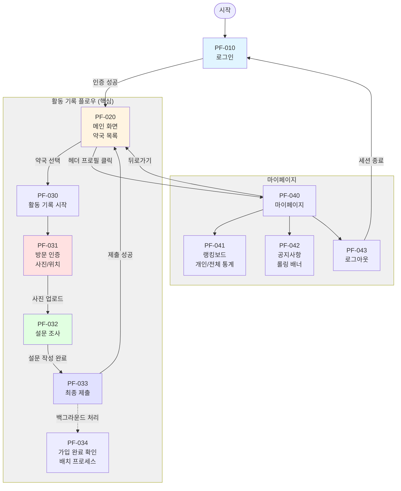
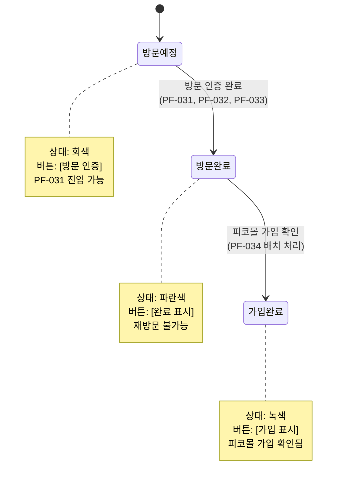

# 피코프렌즈 화면설계서 - 사용자 (Mobile Web)

## 문서 정보
- 버전: Ver 1.4
- 범위: 슬라이드 1-10 분석 결과
- 분석일: 2025-10-27

## 버전 이력
| 일자 | 버전 | 내용 | 담당자 |
|------|------|------|--------|
| 2025.10.17 | 1.1 | 초안 개발팀 검토 | 오창섭 |
| 2025.10.21 | 1.2 | 1.1 형의 내용 수정 및 재설계 (사용자, 관리자) | 오창섭 |
| 2025.10.24 | 1.3 | 1.2 형의 내용 수정 및 재설계 | 오창섭 |
| 2025.10.27 | 1.4 | 최종 취합 및 정리 | 오창섭 |

## 화면 ID 범위
- Mobile Web: PF-010 ~ PF-043

## 화면 ID 구조 요약

### 전체 화면 구조 (IA)

> 💡 **참고**: 상세한 IA 구조는 [06_information_architecture.md](./06_information_architecture.md)를 참조하세요.

| 화면 ID | Depth 1 | Depth 2 | Depth 3 | 화면명 | 비고 |
|---------|---------|---------|---------|--------|------|
| **PF-010** | **로그인** | | | | |
| PF-011 | | | 아이디/PW 입력 | 계정 정보 입력 | |
| PF-012 | | | 로그인 버튼 | 인증 및 메인 이동 | |
| **PF-020** | **메인** | **(오늘의 방문 목록)** | | | |
| PF-021 | | | 상태 필터 | 전체/배정 전/방문 완료 | 기본값: 배정 전 |
| PF-022 | | | 약국 리스트 | 약국 카드 목록 표시 | 무한 스크롤 |
| **PF-030** | **활동 기록** | | | | 31→32→33→34 순차 진행 |
| PF-031 | | (Step 1) | 방문 인증 | 사진/위치 촬영 | 갤러리 접근 불가 |
| PF-032 | | (Step 2) | 설문 조사 | 설문 작성 | 관리자 설정 문항 |
| PF-033 | | (Step 3) | 최종 제출 | 데이터 전송 | 중복 제출 방지 |
| PF-034 | | (Step 4) | 회원 가입 확인 | 가입 완료 처리 | 배치 자동 처리 |
| **PF-040** | **마이페이지** | | | | |
| PF-041 | | | 랭킹보드 | 개인/전체 통계 | 1~10위 표시 |
| PF-042 | | | 공지사항 | 공지사항 목록 | 롤링 배너 |
| PF-043 | | | 로그아웃 | 세션 종료 | |

### 사용자 플로우

**플로우 주요 포인트:**
1. **PF-031 (방문 인증)**: 카메라 실행, 갤러리 접근 불가 (보안), 위치 정보 수집
2. **PF-032 (설문 조사)**: 관리자 설정 설문지, 단답형/장문형/선택형
3. **PF-033 (최종 제출)**: 모든 데이터 전송, 중복 제출 방지
4. **PF-034 (가입 확인)**: 사업자번호 기준, 배치 프로세스로 자동 처리

### 화면 상태 전환

**상태 전환 규칙:**
- **방문 예정 → 방문 완료**: 사진 인증 + 설문 제출 완료 시
- **방문 완료 → 가입 완료**: 사업자번호로 피코몰 가입 확인 시 (자동)

## 분석된 화면 목록

### 공통 영역: 로그인 이후 헤더

**적용 범위:**
- 로그인 이후 모든 화면(PF-020 ~ PF-040)의 상단(헤더) 영역에 공통으로 적용

**헤더 구성:**
1. 공지사항 영역
   - 관리자가 작성한 공지사항이 롤링되어 보여짐
   - 최근 작성된 3개의 게시글이 10초 간격으로 반복하여 나타남
   - 클릭 시 공지사항 팝업으로 이동

2. 로그아웃 버튼
   - 클릭 시 로그아웃 처리 후 로그인 화면(PF-010)으로 이동

3. 마이페이지 진입 버튼
   - 우측 상단 프로필 아이콘
   - 클릭 시 PF-040 화면으로 이동

4. 상담톡 버튼
   - 관리자와 실시간으로 소통할 수 있는 기능
   - 마이페이지(PF-040) 화면에서는 미표기

**공지사항 팝업:**
- 공지사항 클릭 시 표시되는 모달 화면
- 관리자가 작성한 공지사항이 모든 학생들에게 노출
- 이미지와 텍스트가 함께 표시됨
- 닫기 버튼 클릭 시 원래 화면으로 돌아감

---

### 1. PF-010: 로그인 및 회원가입
**화면 구성:**
- 로그인 화면
  - 이메일 주소 입력
  - 비밀번호 입력
  - 로그인 버튼
  - "계정이 없으신가요? 회원가입" 링크

- 회원가입 화면
  - 이메일 주소
  - 비밀번호
  - 이름
  - 전화번호
  - 소속학교 (드롭다운 선택)
  - 가입신청 버튼
  - "이미 계정이 있으신가요? 로그인" 링크

**소속학교 리스트:**
37개 학교 리스트 존재
- 가천대학교
- 가톨릭대학교
- 강원대학교
- 경북대학교
- 경상국립대학교
- 경성대학교
- 경희대학교
- 계명대학교
- 고려대학교(세종)
- 단국대학교
- 대구가톨릭대학교
- 덕성여자대학교
- 동국대학교
- 동덕여자대학교
- 목포대학교
- 부산대학교
- 삼육대학교
- 서울대학교
- 성균관대학교
- 숙명여자대학교
- 순천대학교
- 아주대학교
- 연세대학교
- 영남대학교
- 우석대학교
- 원광대학교
- 이화여자대학교
- 인제대학교
- 전남대학교
- 전북대학교
- 제주대학교
- 조선대학교
- 중앙대학교
- 차의과학대학교
- 충남대학교
- 충북대학교
- 한양대학교

### 2. PF-020: 로그인 후 화면 - 배정된 업무

**화면 상태:**
1. 업무가 배정되지 않았을 때
   - 배정된 업무가 없다는 안내 표시
   - 업무를 요청할 수 있는 버튼 표기
   - 업무 요청 시 관리자 게시판에 업무 배정 요청이 기록됨

2. 업무가 배정되었을 때
   - 배정된 약국 정보가 카드 형식으로 표기됨
   - 약국 카드 정보:
     - 약국명 (예: OOO 약국)
     - 사업자번호: 000-0000-0000
     - 주소: 서울시 강남구 테헤란로 123
     - 연락처: 000-0000-0000
     - "방문 인증" 버튼 (활성화)
     - "방문 완료" 버튼 (비활성화)
     - "가입 완료" 버튼 (비활성화)
   - 검색 필터를 통해 업무 내역 검색 가능

**검색 필터 기능 (업무 배정 시):**
1. Select Box
   - 첫 번째 항목: 기본값 또는 선택 유도 문구 표시
   - 5개 이상 옵션 시: 스크롤 바 제공
   - 항목 리스트
     - "전체 보기"
     - "방문 예정"
     - "방문 완료"
     - "가입 완료"

2. Calendar
   - 날짜 형식: YYYY.MM.DD
   - 기본값: 현재 년, 월, 일
   - 이전/다음 월 이동 방식 제공
   - 화면이 작아 사용이 불편할 경우 다른 방식으로 대체

3. Text Box
   - 텍스트 좌측 정렬
   - Placeholder 제공

4. Button
   - 버튼명: 가운데 정렬
   - 버튼 위치: 우측 정렬

**디자인 노트:**
- 필터는 모바일 환경에 맞게 한 줄이 아닌 두 줄로 표현

### 3. PF-030: 배정된 업무 목록 및 방문 인증

**화면 구성:**
- 배정된 약국 목록이 카드 형식으로 표시
- 모바일 화면에 맞게 세로 스크롤 방식으로 구성
- 하단으로 계속 늘어나며 보여지는 무한 스크롤 방식

**약국 카드 버튼 상태:**
1. 방문 인증이 완료되지 않았을 때
   - "방문 인증" 버튼 활성화 (클릭 가능)
   - 카드 정보: 약국명, 사업자번호, 주소, 연락처, 상세보기 아이콘

2. 방문 인증이 완료되었을 때
   - "방문 인증" 버튼 비활성화
   - 자동으로 "방문 완료" 버튼으로 변경

3. 회원 가입이 완료되었을 때
   - 사업자 번호 기준으로 피코몰 가입 확인 시
   - "방문 완료" 버튼이 "가입 완료" 버튼으로 변경

**방문 인증 기능:**
1. 방문 인증 버튼 클릭 시
   - 모달 팝업 표시
   - 사진 업로드 영역 제공
   - "방문 사진 등록" 버튼 표시

2. 사진 등록 후
   - 사진을 업로드하고 "방문 사진 등록" 버튼 클릭
   - 다음 화면(설문 조사)으로 자동 이동

**설문 조사 기능:**
1. 설문 조사 화면
   - 타이틀: "2025년 하반기 판매 동향 조사"
   - 대상 약국 표시: "대상 약국: {NAME}"
   - 안내 문구: "약사님을 대상으로 현장 설문을 진행합니다."
   - "설문 조사" 버튼

2. 설문 내용
   - 관리자가 지정한 설문조사 항목
   - 설문 완료 후 다음 단계로 진행

**방문 완료 처리:**
1. 자동 처리 조건
   - 방문 인증(사진 등록) 완료
   - 설문 조사 버튼까지 클릭
   - 위 두 단계 완료 시 자동으로 "방문 완료" 상태로 전환

2. 가입 완료 전환
   - 해당 사업자 번호로 피코몰 가입 시 "방문 완료" 버튼이 "가입 완료"로 자동 변경
   - "가입 완료"는 별도 배치 서비스에서 데이터 처리 예정

**메모(특이사항) - 설문 조사:**

**화면 개요:**
- 메모(특이사항) = 설문 조사 화면
- 약국 방문 시 현장 설문을 진행하는 기능
- 피코프렌즈가 직접 각 항목을 작성하여 제출

**설문 답변(리포트) 기록 기능:**
1. 약국 정보 자동 조회
   - 피코프렌즈 DB에서 배정된 약국 정보를 자동으로 조회
   - 약국 기본 정보(약국명, 사업자번호, 주소, 연락처) 자동 입력
   - 작성 시간 단축 및 입력 오류 방지

2. 설문 답변(리포트) 이력 관리
   - 피코프렌즈가 작성한 설문 답변(리포트)은 DB에 영구 보존
   - 다음 번 업무 배정 시에도 이전 설문 답변 내역이 누적되어 표시
   - 약국별 방문 이력 및 설문 답변(리포트) 내역 추적 가능

**설문 조사 양식 유형:**
- 단답형: 텍스트 입력 (한 줄, 짧은 답변)
- 장문형: 텍스트 입력 (여러 줄, 상세한 답변)
- 선택형 (체크박스): 중복 선택 가능
- 선택형 (라디오박스): 단일 선택만 가능
- 기타 입력: 선택형에서 "기타" 선택 시 단답형 텍스트 입력 (한 줄)

**설문 조사 기본 양식:**

1. **약국 기본 정보**
   - 약사님 성함
     - 유형: 단답형 (한글 텍스트 입력)
   - 약사님 연락처
     - 유형: 단답형 (번호 형식, 예: 010-1234-1234)

2. **약국 운영 및 애로 사항**
   - 온라인몰 이용 현황
     - 유형: 체크박스 (중복 선택 가능)
     - 옵션:
       - HMP몰(온라인팜)
       - 새로팜
       - 더샵
       - 바로팜
       - 팜스트리트
       - 광동샵
       - JW샵
       - 유팜몰
       - 기타 (단답형 입력)

3. **주력 판매 상품군**
   - 유형: 체크박스 (중복 선택 가능)
   - 옵션:
     - 전문의약품
     - 일반의약품
     - 일반의료품
     - 건강 기능 식품
     - 의료 기기 및 기타

4. **주력 판매 제품**
   - 유형: 장문형 (텍스트 직접 입력)

5. **가장 시급하게 필요한 제품**
   - 유형: 장문형 (텍스트 직접 입력)

6. **마케팅 및 홍보 관련 고민**
   - 유형: 체크박스 (중복 선택 가능)
   - 옵션:
     - 포털/SNS 광고
     - 지역 홍보물(신문, 구청 등)
     - 디지인(POP 등)
     - 약사 채널 운영
     - 최신 정보(트렌드)
     - 고객관리(CRM)
     - 기타 (단답형 입력)

7. **피코프렌즈 반응**
   - 피코몰 체력 안내 후 반응
     - 유형: 라디오박스 (단일 선택)
     - 옵션:
       - 매우 좋음
       - 좋음
       - 보통
       - 나쁨
       - 기타 (단답형 입력)

8. **현장활동 요약 및 다음 단계 계획**
   - 유형: 장문형 (텍스트 직접 입력)
   - 내용: 현장 방문 시 특이사항, 약사님 반응, 후속 조치 사항 등 자유롭게 기록

**데이터 관리:**
- 설문 조사 데이터는 관리자 페이지에서 통계 확인 가능
- 항목별 집계, 약국별 상세 내역, 기간별 비교 등 다양한 형태로 조회
- 엑셀 다운로드 기능 제공

**디자인 노트:**
- 업무 목록은 무한 스크롤 방식으로 구현
- 각 약국 카드는 동일한 높이와 레이아웃 유지
- 버튼 상태에 따라 시각적 차이 명확히 표현 (활성화/비활성화)
- 설문 조사: 모바일 화면에 최적화된 입력 UI
- 각 설문 항목은 명확한 구분선으로 분리
- 체크박스/라디오박스는 터치 영역 충분히 확보
- "기타" 선택 시 텍스트 입력창 즉시 활성화
- 하단 "등록하기" 또는 "제출" 버튼 배치

### 4. PF-040: 마이페이지 클릭 후 화면

**화면 구성:**
- 대시보드 기능
  - 오늘 방문약국 수, 회원가입 약국 수를 자동 표기
  - (각 데이터는 매일 저녁 6시 자동 취합)
- 이미지 기능
  - 관리자가 지정한 이미지를 노출 한다.
- 랭킹보드(다른 피코프렌즈 오늘의 방문 1위 ~ 10위 확인)
  - 랭킹 순위가 정해지며 동점자가 있을 경우 닉네임(이메일 앞자리 3글자 뒤에 *** 표기)에 함께 표기한다.
  - 하단 데이터 취합 기준 고지: "※ 이번 주의 랭킹은 지난 주차 금요일 저녁 6시 데이터 비교 기준"

**피코프렌즈 주간 랭킹보드 운영 규칙:**
1. 랭킹보드 집계 기준
   - 집계 시점: 매주 금요일 18:00
   - 집계 방식: 해당 시점까지 누적된 총점(2항 참고)으로 금주 순위 확정
   - 비교 대상: '지난주 금요일 18:00' 기준 순위 (1주 차에는 'NEW'로 표기)

2. 랭킹보드 표기 항목 (CRM/대시보드 노출)
   - 순위 (Rank): 금주 최종 순위
   - 이름 (Name): 피코프렌즈 닉네임(로그인 아이디 3글자 뒷자리 *** 표기)
   - 순위 변동 (Rate of Change): 지난주 대비 순위 증감 (핵심)
   - 회원가입 약국 수 (Pharm): 해당 주차 피코몰 가입을 신청한 약국

3. 점수 산정 기준 (KPI)
   - [기본] 방문 (Visit): CRM 기준 약국 방문 로그 1개처당 10점
   - [핵심] 회원가입 신청(Sign): 피코몰 신규 가입 1개처당 100점

4. '순위 변동' (증감율) 표기 방식
   - ▲N: 지난주 대비 N 순위 상승 (예: 15위 → 10위 시, ▲5)
   - ▼N: 지난주 대비 N 순위 하락 (예: 10위 → 12위 시, ▼2)
   - -: 순위 변동 없음
   - NEW: 랭킹보드 신규 진입 (1주 차 활동 시작 시 전원 'NEW')

5. 동점자 처리 기준
   - 총점이 동점일 경우, ① 총 신규 회원가입 건수 → ② 총 방문 건수 순으로 순위를 결정

