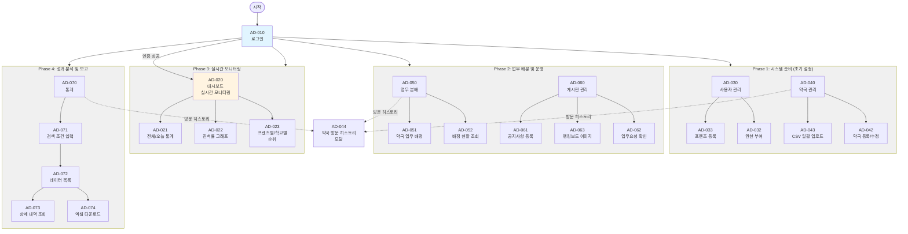

# 피코프렌즈 화면설계서 - 관리자 (Admin Web)

## 문서 정보
- 버전: Ver 1.5
- 범위: 슬라이드 11-26 분석 결과 (백오피스 Web 화면)
- 분석일: 2025-10-27
- 최종 업데이트: 2025-10-30
- **상태**: ✅ 최신화 완료

## 백오피스 화면 ID 범위
- Web Admin: AD-010 ~ AD-074

## 화면 ID 구조 요약

### 전체 화면 구조 (IA)

> 💡 **참고**: 상세한 IA 구조는 [06_information_architecture.md](./06_information_architecture.md)를 참조하세요.

| 화면 ID | Depth 1 | Depth 2 | Depth 3 | 화면명 | 비고 |
|---------|---------|---------|---------|--------|------|
| **AD-010** | **로그인** | | | 관리자 계정 로그인 | PF-010과 동일 |
| **AD-020** | **대시보드** | | | 홈 화면 | |
| AD-021 | | | 전체/오늘 통계 | 약국방문, 회원가입, 전환율 | |
| AD-022 | | | 전체 진척률 | 통계 그래프 (일자/주차/월간) | |
| AD-023 | | | 프렌즈별/학교별 순위 | 성과 랭킹 | |
| **AD-030** | **사용자 관리** | | | 피코프렌즈 계정 관리 | |
| AD-031 | | | 프렌즈 목록 조회 | 전체 사용자 목록 | |
| AD-032 | | | 권한 부여/수정 | 뷰어, 관리자, 피코프렌즈 | |
| AD-033 | | | 프렌즈 등록/수정 | 신규 계정 생성 및 수정 | |
| **AD-040** | **약국 관리** | | | 약국 데이터 관리 | |
| AD-041 | | | 약국 목록 조회 | 전체 약국 DB | |
| AD-042 | | | 약국 등록/수정 | 신규 약국 등록 및 수정 | |
| AD-043 | | | CSV 일괄 업로드 | 대량 데이터 등록 | |
| AD-044 | | | 약국 방문 히스토리 | 방문 기록 조회 | 모달 |
| **AD-050** | **업무 분배** | | | 약국-피코프렌즈 배정 | |
| AD-051 | | | 약국 업무 분배 | 피코프렌즈에게 업무 할당 | |
| AD-052 | | | 약국 업무 조회 | 배정/미배정 조회 | |
| AD-053 | | | 약국 정보 조회 | 히스토리 확인 | |
| **AD-060** | **게시판 관리** | | | 공지사항 및 콘텐츠 관리 | |
| AD-061 | | | 공지사항 | 공지사항 등록/수정/삭제 | |
| AD-062 | | | 업무요청 | 피코프렌즈 업무 요청 확인 | |
| AD-063 | | | 랭킹보드 | 랭킹보드 이미지 관리 | |
| **AD-070** | **통계** | | | 데이터 조회 및 분석 | |
| AD-071 | | | 상세 검색/필터 | 조건별 데이터 검색 | |
| AD-072 | | | 데이터 목록 | 활동 데이터 목록 표시 | |
| AD-073 | | | 상세 보기 | 개별 활동 상세 조회 | |
| AD-074 | | | 엑셀 다운로드 | CSV 파일 추출 | |

### 관리자 플로우



**플로우 주요 포인트:**

**Phase 1: 시스템 준비 (초기 설정)**
- **AD-030 (사용자 관리)**: 피코프렌즈 계정 생성 및 권한 부여
- **AD-040 (약국 관리)**: CSV 일괄 업로드로 1,600개 약국 데이터 등록

**Phase 2: 업무 배분 및 운영**
- **AD-050 (업무 분배)**: 피코프렌즈에게 약국 배정
- **AD-060 (게시판 관리)**: 공지사항, 랭킹보드 이미지, 업무요청 관리

**Phase 3: 실시간 모니터링**
- **AD-020 (대시보드)**: 전체/오늘 통계, 진척률, 순위 실시간 확인

**Phase 4: 성과 분석 및 보고**
- **AD-070 (통계)**: 조건별 검색, 상세 조회, CSV 다운로드

**공통 기능:**
- **AD-044 (약국 방문 히스토리)**: 약국 관리, 업무 분배, 통계에서 접근 가능한 모달

## 백오피스 메뉴 구조

```
홈
├── 대시보드
├── 사용자관리
├── 약국관리
├── 업무분배
├── 게시판관리
└── 통계
```

## 분석된 화면 목록

### 1. AD-010: 로그인

**화면 구성:**
- [PF-010](01_screen_picofriends.md#1-pf-010-로그인-및-회원가입)(사용자 모바일 웹 로그인 화면)과 동일한 화면 사용

**로그인 화면:**
- 이메일 주소 입력
- 비밀번호 입력
- 로그인 버튼
- "계정이 없으신가요? 회원가입" 링크

**회원가입 화면:**
- 이메일 주소
- 비밀번호
- 이름
- 전화번호
- 소속학교 (드롭다운 선택)
  - 37개 학교 리스트 제공 (가천대, 가톨릭대, 강원대, 경북대, 경상국립대, 경성대, 경희대, 계명대, 고려대(세종), 단국대, 대구가톨릭대, 덕성여대, 동국대, 동덕여대, 목포대, 부산대, 삼육대, 서울대, 성균관대, 숙명여대, 순천대, 아주대, 연세대, 영남대, 우석대, 원광대, 이화여대, 인제대, 전남대, 전북대, 제주대, 조선대, 중앙대, 차의과대, 충남대, 충북대, 한양대)
- 가입신청 버튼
- "이미 계정이 있으신가요? 로그인" 링크

**계정 구분:**
- **관리자 계정**: 로그인 시 AD-020(대시보드) 화면으로 이동
- **피코프렌즈 계정**: 로그인 시 PF-020(메인 화면) 화면으로 이동

**가입 승인 프로세스:**
- 회원가입 신청 후 관리자 승인 필요
- 승인 관리는 [AD-030(사용자 관리)](#3-ad-030-사용자-관리)에서 처리

**참고:**
- 상세 로그인 화면 구성은 [01_screen_picofriends.md](01_screen_picofriends.md#1-pf-010-로그인-및-회원가입)의 PF-010 참조

---

### 공통 영역: 로그인 이후 헤더

**적용 범위:**
- 로그인 이후 모든 관리자 화면(AD-020 ~ AD-070)의 상단(헤더) 영역에 공통으로 적용

**헤더 구성:**
1. 로고 영역
   - 좌측 상단: PICO Innovation 로고
   - 클릭 시 대시보드(AD-020) 화면으로 이동

2. 환영 메시지 및 로그아웃
   - 우측 상단: "환영합니다. {NAME} 담당자님."
   - 로그아웃 링크: 클릭 시 로그아웃 처리 후 로그인 화면(AD-010)으로 이동

**네비게이션 메뉴:**
- 헤더 하단에 위치한 메인 메뉴
- 메뉴 구성:
  1. **대시보드**: AD-020 화면으로 이동
  2. **사용자관리**: AD-030 화면으로 이동
  3. **약국관리**: AD-040 화면으로 이동
  4. **업무분배**: AD-050 화면으로 이동
  5. **게시판 관리**: AD-060 화면으로 이동
  6. **통계**: AD-070 화면으로 이동
- 현재 활성화된 메뉴는 시각적으로 강조 표시

---

### 2. AD-020: 대시보드 (홈)

**화면 구성:**
1. 주요 지표 위젯 (2행 3열)
   - 1행: 전체 통계
     - 약국 방문(전체): OO
     - 회원 가입(전체): OO
     - 전환율(전체): OO%
   - 2행: 오늘 통계
     - 약국 방문(오늘): OO
     - 회원 가입(오늘): OO
     - 전환율(오늘): OO%

2. 통계 그래프 영역
   - 좌측: 전체 진척률 (도넛 차트)
     - 방문 완료 vs 방문 전 비율 표시
   - 우측: 프렌즈별 활동 순위 (가로 막대 그래프)
     - 상위 5명 순위 표시

3. 학교별 성과
   - 상세 통계 차트

**기능 상세:**
1. 전체 통계 지표
   - 약국 방문(전체): 전체 방문 수
   - 회원 가입(전체): 전체 약국 가입 수
   - 전환율(전체) = (약국 가입 수 ÷ 전체 방문 수) × 100

2. 오늘 통계 지표
   - 약국 방문(오늘): 금일 방문 수
   - 회원 가입(오늘): 금일 가입 수
   - 전환율(오늘) = (금일 가입 수 ÷ 금일 방문 수) × 100

3. 피코프렌즈 전체 인원 통계 그래프
   - 데이터 기준: 약국 방문, 회원가입
   - 그래프 형태: 막대 그래프, 띠 그래프
   - 조회 기간: 일자, 주차, 월간
   - 구분: 전체, 오늘

4. 진척률 계산
   - 진척률(%) = (현재일까지 계획된 작업량 ÷ 프로젝트 전체 작업량) × 100
   - 기준: 등록된 약국 기준 방문 수, 회원 가입 수

5. 프렌즈별 활동 순위
   - 상위 5명 순위를 가로 막대 그래프로 표시

6. 학교별 성과
   - 학교별 성과 데이터 시각화
   - 각 학교(소속학교)별 피코프렌즈의 활동 성과를 그래프로 표시

**데이터 처리:**
- 일부 데이터는 대시보드에서 직접 표시
- 상세 데이터는 Redash를 활용하여 조회

### 3. AD-030: 사용자 관리

**화면 구성:**
1. 조건부 검색 필터 (3개 필터)
   - **역할** 드롭다운:
     - 전체보기 (기본값)
     - 뷰어
     - 관리자
     - 피코프렌즈
   - **상태** 드롭다운:
     - 전체보기 (기본값)
     - 승인대기
     - 승인됨
     - 승인 거부
   - **이름으로 검색** 텍스트박스:
     - Placeholder: "검색어를 입력해주세요."
     - 검색 버튼

2. 액션 버튼
   - **+ 사용자 등록** 버튼: 사용자 등록 모달 오픈
   - **CSV 내보내기** 버튼: 검색된 사용자 정보 CSV 다운로드

3. 사용자 리스트 테이블
   - **컬럼 구성**:
     - 이름
     - 이메일(ID)
     - 전화번호
     - 소속 (소속학교)
     - 상태
     - 관리
     - 비고

   - **상태 표시**:
     - 승인대기: 녹색 "승인" 버튼 + 빨간색 "거부" 버튼 표시
     - 승인됨: "승인" 텍스트 표시
     - 승인 거부: "거부" 텍스트 표시

   - **관리 컬럼**:
     - 수정 아이콘 (연필): 사용자 정보 수정 모달 오픈
     - 삭제 아이콘 (휴지통): 사용자 정보 삭제

   - **페이지네이션**: 이전 / 페이지 번호 / 다음

**사용자 등록 모달:**
- 제목: "사용자 등록"
- 서브타이틀: "피코프렌즈 사용자 정보를 등록합니다."
- 입력 필드:
  - 이메일: email@example.com
  - 비밀 (비밀번호)
  - 이름: Placeholder "홍길동"
  - 전화: Placeholder "010-1234-5678"
  - 소속학교: 드롭다운 선택 (37개 학교 리스트)
- 버튼: "사용자 등록" (파란색)

**사용자 정보 수정 모달:**
- 제목: "사용자 정보 수정"
- 서브타이틀: "피코프렌즈 사용자 정보를 수정합니다."
- 입력 필드: 사용자 등록 모달과 동일
- 버튼: "사용자 수정" (파란색)

**기능 상세:**
1. **조건부 검색 기능**
   - 역할별 필터링: 전체보기, 뷰어, 관리자, 피코프렌즈
   - 상태별 필터링: 전체보기, 승인대기, 승인됨, 승인 거부
   - 이름 검색: 텍스트 입력 후 검색 버튼 클릭

2. **사용자 등록**
   - 수동 사용자 등록 기능
   - 회원가입 화면과 동일한 입력 필드
   - 역할 구분: 관리자, 뷰어, 피코프렌즈

3. **CSV 내보내기**
   - 검색 필터 적용 후 결과를 CSV 파일로 다운로드
   - 사용자 정보 일괄 조회 및 백업 용도

4. **승인/거부 처리**
   - 승인대기 상태의 사용자에게 "승인" 또는 "거부" 버튼 표시
   - 승인되어야 로그인 가능
   - 승인 시: 상태가 "승인됨"으로 변경
   - 거부 시: 상태가 "승인 거부"로 변경

5. **사용자 정보 수정/삭제**
   - 수정: 관리자가 사용자 정보를 직접 수정 가능
   - 삭제: 사용자 정보 완전 삭제 (복구 불가)

6. **관리자 코멘트 작성**
   - 비고 컬럼에 관리자가 코멘트 작성 가능
   - 사용자별 메모 및 관리 이력 기록

### 4. AD-040: 약국 관리

**화면 구성:**
1. 액션 버튼
   - **+ 새 약국 추가** 버튼: 약국 등록 모달 오픈
   - **CSV 가져오기** 버튼 (녹색): CSV 파일로 약국 정보 일괄 등록
   - **CSV 내보내기** 버튼 (녹색): 등록된 약국 리스트 CSV 다운로드

2. 약국 리스트 테이블
   - **컬럼 구성**:
     - 약국명
     - 주소
     - 사업자 등록번호
     - 전화번호
     - 히스토리
     - 비고
     - 관리

   - **히스토리 컬럼**:
     - 리스트 아이콘 (세 줄 아이콘)
     - 클릭 시 약국 방문 히스토리 모달 오픈 (AD-044 참조)

   - **관리 컬럼**:
     - 수정 아이콘 (연필): 약국 정보 수정 모달 오픈
     - 삭제 아이콘 (휴지통): 약국 정보 삭제

   - **페이지네이션**: 이전 / 페이지 번호 / 다음

**약국 등록 모달:**
- 제목: "약국 등록"
- 서브타이틀: "피코프렌즈 약국 정보를 등록합니다."
- 입력 필드:
  - 이름: Placeholder "약국명"
  - 주소: 텍스트 입력
  - 사업자등록번호: Placeholder "000-00-00000"
  - 전화번호: Placeholder "02-1234-5678"
- 버튼: "약국 등록" (파란색)

**약국 정보 수정 모달:**
- 제목: "약국 정보 수정"
- 서브타이틀: "피코프렌즈 약국 정보를 수정합니다."
- 입력 필드: 약국 등록 모달과 동일
- 버튼: "약국 정보 수정" (파란색)

**기능 상세:**
1. **약국 등록**
   - 새 약국 추가 시 테이블의 정보를 입력하여 등록
   - 약국명, 주소, 사업자등록번호, 전화번호 필수 입력

2. **CSV 가져오기/내보내기**
   - CSV 가져오기: CSV 파일로 작성한 약국 정보를 시스템에 일괄 등록
   - CSV 내보내기: 등록된 약국 리스트를 CSV 파일로 다운로드
   - 대량 데이터 관리 및 백업 용도

3. **히스토리 확인**
   - 히스토리 아이콘 클릭 시 약국 방문 히스토리 확인
   - 히스토리 내용: 담당 피코프렌즈, 방문 일자, 설문 데이터 등
   - 상세 내용은 [AD-044 (약국 방문 히스토리)](#5-ad-044-약국-방문-히스토리) 참조

4. **비고 작성**
   - 비고 컬럼에 관리자가 코멘트를 직접 작성
   - 약국별 메모 및 관리 이력 기록

5. **약국 정보 수정/삭제**
   - 수정: 약국 정보를 직접 수정 가능
   - 삭제: 약국 정보 완전 삭제 (복구 불가)

### 5. AD-044: 약국 방문 히스토리

**화면 구성 (메인 모달):**
- **모달 형태**로 표시
- 제목: "약국 방문 히스토리"
- 닫기 버튼 (X 아이콘)

**약국 기본 정보 (상단):**
- 약국 이름: OOOO약국 (자동 불러오기)
- 약국 사업자번호: 000-00-00000 (자동 불러오기)
- 약사 이름: OOO (자동 불러오기)
- 약국 연락처: 00-000-0000 (자동 불러오기)

**방문 히스토리 테이블:**
- **컬럼 구성**:
  - 방문일시
  - 회원 가입 일시
  - 피코프렌즈 (담당자)
  - 히스토리
  - 비고
  - 관리

- **히스토리 컬럼**:
  - 리스트 아이콘 (세 줄 아이콘)
  - "리포트" 버튼 (파란색): 클릭 시 **설문조사 조회 모달** 오픈
  - 피코프렌즈가 작성한 설문 답변 내용 확인

- **관리 컬럼**:
  - 수정 아이콘 (연필): 방문 히스토리 수정
  - 삭제 아이콘 (휴지통): 방문 히스토리 삭제

- **데이터 표시**:
  - 가장 최근 히스토리가 테이블의 첫 번째 줄에 표시
  - 방문일시: OOOO-OO-OO 형식
  - 회원 가입 일시: OOOO-OO-OO 형식 (가입하지 않았을 경우 "가입하지 않음" 표기)
  - 피코프렌즈: 담당자 이름

---

**설문조사 조회 모달 (히스토리 "리포트" 버튼 클릭 시):**
- **모달 형태**로 표시 (방문 히스토리 모달 위에 오버레이)
- 제목: "약국 기본 정보"
- **내용**: [PF-030 설문조사 양식](01_screen_picofriends.md#3-pf-030-배정된-업무-목록-및-방문-인증)에 피코프렌즈가 작성한 답변이 채워진 형태로 출력
- **표시 형태**: 읽기 전용 (작성된 설문 답변 내용 조회)

**설문 답변 항목:**
1. 약국 기본 정보 (약사님 성함, 연락처)
2. 약국 운영 및 애로 사항 (온라인몰 이용 현황)
3. 주력 판매 상품군
4. 주력 판매 제품
5. 가장 시급하게 필요한 제품
6. 마케팅 및 홍보 관련 고민
7. 피코프렌즈 반응 (피코몰 체험 안내 후 반응)
8. 현장활동 요약 및 다음 단계 계획

> 💡 **참고**: 설문조사 양식의 상세 항목 및 유형은 [01_screen_picofriends.md - PF-030 설문 조사 기본 양식](01_screen_picofriends.md#설문-조사-기본-양식) 참조

---

**기능 상세:**
1. **약국 정보 자동 불러오기**
   - 약국 이름, 약사 이름, 약국 사업자번호, 약국 연락처는 등록된 정보를 자동으로 불러옴

2. **방문 히스토리 표시**
   - 피코프렌즈가 방문한 일시가 나타남
   - 회원가입 시 회원 가입 일시 표시
   - 회원가입을 하지 않았을 경우 "가입하지 않음" 표기
   - 가장 최근 히스토리가 테이블 첫 번째 줄에 위치

3. **설문조사 확인 (2단계 모달 구조)**
   - 히스토리 컬럼의 "리포트" 버튼 클릭 시 **설문조사 조회 모달**이 추가로 팝업
   - 피코프렌즈가 작성한 설문 답변 내용을 별도 모달로 표시
   - 설문 양식: [PF-030 설문조사 양식](01_screen_picofriends.md#설문-조사-기본-양식)에 답변이 채워진 형태
   - 표시 형태: 읽기 전용 (작성된 답변 조회)

4. **비고 입력 및 수정**
   - 비고 컬럼에 관리자가 직접 텍스트로 입력 가능
   - 클릭 시 입력/수정 가능
   - 한 줄 내 텍스트 작성

5. **방문 히스토리 수정/삭제**
   - 수정: 방문 히스토리 정보 수정
   - 삭제: 방문 히스토리 삭제 (복구 불가)

### 6. AD-050: 업무 분배

**화면 구성:**
1. 조건부 검색 필터 (3개 필터)
   - **약국** 드롭다운:
     - Placeholder: "이름으로 검색"
   - **상태** 드롭다운:
     - 전체보기 (기본값)
     - 전체보기
     - 미방문
     - 방문완료
     - 가입완료
   - **사용자 이름으로 검색** 텍스트박스:
     - Placeholder: "검색어를 입력해주세요."
     - 검색 버튼

2. 액션 버튼
   - **CSV 가져오기** 버튼 (녹색): CSV 파일로 업무 분배 정보 일괄 등록
   - **CSV 내보내기** 버튼 (녹색): 업무 분배 결과 CSV 다운로드
   - **{NUM} 업무 배분** 버튼 (파란색): 선택한 약국 개수 표시, 클릭 시 피코프렌즈 업무 배분 모달 오픈

3. 업무 리스트 테이블
   - **컬럼 구성**:
     - 체크박스 (다중 선택)
     - 약국이름
     - 주소
     - 전화번호
     - 상태
     - 피코프렌즈 (현재 담당자)
     - 히스토리
     - 비고

   - **상태 표시**:
     - 미방문: "미방문" 텍스트
     - 방문완료: "방문완료" 텍스트
     - 가입완료: "가입완료" 텍스트

   - **피코프렌즈 컬럼**:
     - 배당됨: "배당됨" 버튼 (파란색) - 클릭 시 담당자 정보 확인 또는 변경
     - 미배정: "담당자 없음" 텍스트

   - **히스토리 컬럼**:
     - 리스트 아이콘 (세 줄 아이콘)
     - 클릭 시 약국 방문 히스토리 모달 오픈 ([AD-044](#5-ad-044-약국-방문-히스토리) 참조)

   - **페이지네이션**: 이전 / 페이지 번호 / 다음

**피코프렌즈 업무 배분 모달:**
- 제목: "피코프렌즈 업무 배분"
- 서브타이틀: "피코프렌즈에 업무를 할당합니다."
- **피코프렌즈 이름 검색**:
  - Placeholder: "피코프렌즈 이름 검색"
  - 검색 버튼

- **피코프렌즈 선택 테이블**:
  - 컬럼: 라디오 버튼, 이름, 학교, 비고
  - **라디오 버튼**: 1명만 선택 가능 (각 약국에 1명만 할당)
  - **이름**: 피코프렌즈 이름 ({NAME})
  - **학교**: 소속학교
  - **비고**: 메모 작성 가능 (텍스트 입력)

- **버튼**:
  - 취소 (회색)
  - 확인 (파란색): 선택한 피코프렌즈에게 업무 할당

**기능 상세:**
1. **조건부 검색 기능**
   - 약국별 필터링: 이름으로 검색
   - 상태별 필터링: 전체보기, 미방문, 방문완료, 가입완료
   - 사용자 이름 검색: 피코프렌즈 담당자 이름으로 검색

2. **CSV 가져오기/내보내기**
   - CSV 가져오기: CSV 파일로 지정된 형태로 업무 분배 정보 일괄 등록
   - CSV 내보내기: 업무 분배 결과를 CSV 형태로 다운로드

3. **업무 배분 (다중 선택)**
   - 체크박스에 체크하면 체크된 합계 개수가 "{NUM} 업무 배분" 버튼에 표시
   - 버튼 클릭 시 "피코프렌즈 업무 배분" 모달(3-1) 노출
   - 선택한 약국들에 피코프렌즈 담당자 할당

4. **피코프렌즈 업무 배분 (모달)**
   - 등록된 피코프렌즈 검색 및 업무 분배
   - 라디오 버튼으로 1명만 선택 가능 (각 약국에 1명만 할당)
   - 피코프렌즈 담당자 미배정 시 "담당자 없음"으로 표시
   - 비고에 메모 작성 가능

5. **현재 담당자 표시**
   - 피코프렌즈 컬럼에 현재 담당자 표시
   - "배당됨" 버튼: 담당자가 할당된 상태
   - "담당자 없음": 담당자가 미배정된 상태

6. **히스토리 확인**
   - 히스토리 아이콘 클릭 시 약국 방문 히스토리 확인
   - [AD-044 (약국 방문 히스토리)](#5-ad-044-약국-방문-히스토리) 모달 참조

7. **비고 작성**
   - 비고 컬럼에 관리자가 직접 코멘트 입력 및 수정
   - 업무 배분 관련 메모 및 관리 이력 기록

### 7. AD-060: 게시판 관리

**화면 구성:**
1. 게시판 리스트 테이블
   - **컬럼 구성**:
     - 번호
     - 카테고리
     - 제목
     - 작성일
     - 담당자
     - 처리자

   - **데이터 표시**:
     - 리스트 수: 10개씩 표시
     - 노출 항목: 번호/카테고리/제목/작성일/담당자/처리자
     - 리스트 노출 순서: 최신 등록순으로 노출
     - 카테고리 기준 정렬 가능

   - **특수 항목 - 업무 요청**:
     - 제목: "약국 지정 요청드립니다." (고정 제목)
     - 클릭 불가 (단순 확인 용도)
     - 업무 분배 완료 시: 텍스트 및 배경을 회색으로 변경하여 완료 상태 표기
     - 담당자: 업무 분배를 담당한 관리자 표시
     - 처리자: 없는 경우 공란으로 표기

   - **페이지네이션**: << < 1 2 3 4 5 6 7 8 9 10 > >>

2. 검색 기능
   - 드롭다운: "제목+내용" 선택
   - 검색 텍스트박스: 키워드 입력
   - 검색 버튼 (돋보기 아이콘)

3. 액션 버튼
   - **공지사항 작성하기** 버튼 (파란색): 공지사항 작성 화면으로 이동

**공지사항 작성 화면 (3-1):**
- **화면 구성**:
  - **카테고리** 드롭다운: 게시물 분류 선택
  - **작성자**: 작성자 이름 입력
  - **제목**: 제목 입력
  - **내용**: 리치 텍스트 에디터 (텍스트 포맷팅 도구 포함)
    - 폰트, 크기, 색상, 정렬, 이미지 삽입 등 다양한 편집 기능

- **버튼**:
  - 목록보기 (회색): 게시판 리스트로 돌아가기
  - 등록하기 (파란색): 게시물 등록

**카테고리 구분 및 기능:**
1. **[랭킹보드]**
   - 랭킹보드에 나타나는 이미지 관리
   - 내용에 업로드된 이미지를 랭킹보드 지정 위치에 불러옴
   - 이미지 관리 및 게시 기능

2. **[공지사항]**
   - 롤링되는 공지사항 관리
   - 피코프렌즈 모바일 웹 헤더에 표시되는 공지사항 작성
   - 최근 3개의 공지사항이 10초 간격으로 롤링

3. **[업무요청]**
   - 피코프렌즈가 업무 분배를 받지 못하거나 초과 업무를 요청할 때 생성
   - 업무 분배 요청 정보 기록 및 관리
   - 관리자가 업무 분배 처리 후 완료 상태 변경

**기능 상세:**
1. **게시물 관리**
   - 게시물 클릭 시 해당 내용 상세보기 화면으로 이동
   - 카테고리별 정렬 및 필터링 가능
   - 최신 등록순으로 10개씩 노출

2. **업무 요청 처리**
   - 피코프렌즈의 업무 분배 요청 확인
   - 담당자: 업무 분배를 담당한 관리자
   - 처리자: 업무 분배 완료 후 처리한 관리자
   - 완료 시 회색 배경으로 상태 표시

3. **공지사항 작성**
   - 카테고리별 공지사항 작성 및 관리
   - 리치 텍스트 에디터로 다양한 형식의 콘텐츠 작성
   - 이미지 업로드 및 관리

4. **검색 기능**
   - 제목+내용 기준으로 키워드 검색
   - 검색 결과 필터링

### 8. AD-070: 통계

**화면 구성:**
1. 조건부 검색 필터 (5개 필터)
   - **전체보기** 드롭다운:
     - 이름 선택 (피코프렌즈 이름)
     - 디폴트 값: 전체
   - **기간 선택** (캘린더):
     - 시작일: YYYY.MM.DD (캘린더 선택)
     - ~ (구분자)
     - 종료일: YYYY.MM.DD (캘린더 선택)
     - 이전/다음 월 이동 가능
   - **전체** 드롭다운:
     - 전체, 방문완료, 회원가입 필터
     - 디폴트 값: 전체
   - **전체** 드롭다운:
     - 지역 선택 (시/군/동 표기)
     - 디폴트 값: 전체
   - **검색어 입력** 텍스트박스:
     - Placeholder: "검색어를 입력해주세요."
     - 검색 버튼

2. 액션 버튼
   - **[CSV 내보내기]** 버튼 (우측 상단): 검색 결과 CSV 다운로드

3. 통계 테이블
   - **컬럼 구성**:
     - 이름 (피코프렌즈)
     - 지역 (시/군/동 주소)
     - 약국 (약국명)
     - 방문날짜
     - 설문 완료 시간
     - 상태 (방문완료/회원가입)
     - 랭크
     - 히스토리
     - 비고

   - **히스토리 컬럼**:
     - 리스트 아이콘 (세 줄 아이콘)
     - 클릭 시 약국 방문 히스토리 모달 오픈 ([AD-044](#5-ad-044-약국-방문-히스토리) 참조)

   - **비고 컬럼**:
     - 관리자가 텍스트 직접 입력 및 수정
     - 클릭 시 입력/수정 가능

   - **페이지네이션**: 이전 / 페이지 번호 / 다음

4. 하단 통계 바 (파란색 배경)
   - **각 사용자별 집계 표시**:
     - {NAME} (피코프렌즈 이름)
     - 총 배정 수: 00
     - 방문완료 수: 00
     - 회원가입 수: 00
     - 달성률: 00%

   - **전체 보기 및 개별 통계**:
     - 전체 보기 시: 모든 피코프렌즈의 집계 표시
     - 개별 보기 시: 선택한 피코프렌즈의 집계 표시
     - 각 인원의 맨 마지막에 통계 바 표기

**기능 상세:**
1. **조건부 검색 기능**
   - 이름: 피코프렌즈 이름으로 필터링
   - 지역: 시/군/동 표기 기준으로 필터링
   - 약국명: 약국 이름으로 검색
   - 피코프렌즈: 담당자 이름으로 검색
   - 방문/회원가입: 상태별 필터링
   - 기간: 시작일~종료일 범위 선택
   - 디폴트 값: 모든 필터는 "전체"

2. **히스토리 확인**
   - 히스토리 아이콘 클릭 시 약국 방문 히스토리 확인
   - [AD-044 (약국 방문 히스토리)](#5-ad-044-약국-방문-히스토리) 모달 참조
   - 방문 일자, 설문 데이터 등 상세 정보 조회

3. **비고 입력 및 수정**
   - 비고 컬럼에 관리자가 텍스트 직접 입력 및 수정
   - 통계 관련 메모 및 관리 이력 기록

4. **달성률 계산**
   - 달성률(%) = (회원가입 수 ÷ 총 배정 수) × 100
   - 각 피코프렌즈별로 달성률 자동 계산
   - 하단 통계 바에 표시

5. **CSV 내보내기**
   - 검색 결과를 CSV 형태로 다운로드
   - 필터 적용된 데이터만 추출
   - 대량 데이터 분석 및 보고서 작성 용도

6. **페이지네이션**
   - 내역이 많을 경우 페이지 단위로 표시
   - 다음/이전 페이지로 이동 가능

## 종합 정리

### 백오피스 시스템 주요 기능

1. **대시보드**: 전체 통계 및 KPI 모니터링
2. **사용자 관리**: 피코프렌즈 및 관리자 계정 관리, 승인/거부 프로세스
3. **약국 관리**: 약국 정보 CRUD, 방문 히스토리 추적
4. **업무 분배**: 피코프렌즈에게 약국 방문 업무 할당
5. **게시판 관리**: 공지사항 작성 및 관리
6. **통계**: 상세 필터링 및 데이터 추출 기능

### 공통 기능
- CSV Import/Export
- 페이지네이션
- 검색 및 필터링
- 모달 기반 CRUD 작업

