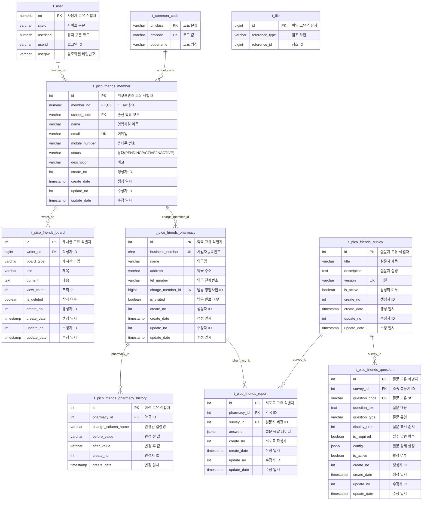

# 피코프렌즈 데이터베이스 스키마 설계

## 1. 개요

본 문서는 피코프렌즈 현장 활동 관리 시스템의 PostgreSQL 데이터베이스 스키마를 정의합니다.

### 1.1 설계 원칙
- 기존 시스템(t_user) 연동을 통한 확장성
- 설문지 버전 관리 지원
- JSONB를 활용한 유연한 설문 응답 저장
- 변경 이력 추적 (pharmacy_history)
- 감사 추적 (create_no, update_no, create_date, update_date)
- 인덱스를 통한 쿼리 성능 최적화

### 1.2 주요 특징
- **설문지 간소화 버전**: 유연한 설문 구조를 위한 JSONB 사용
- **버전 관리**: 설문지 버전별 질문 관리
- **약국당 담당자 1명**: charge_member_id로 관리
- **통계 집계 최적화**: question_code 기준 집계

## 2. ERD (Entity Relationship Diagram)



## 3. 테이블 정의

### 3.1 기존 시스템 테이블

#### t_user (기존 사용자 테이블)

기존 시스템의 사용자 인증 테이블입니다.

```sql
-- 기존 테이블 (참조용)
-- CREATE TABLE t_user (
--     no NUMERIC(11) PRIMARY KEY,
--     siteid VARCHAR(255) NOT NULL DEFAULT 'base',
--     userkind NUMERIC(11) NOT NULL DEFAULT 16,
--     userid VARCHAR(100) NOT NULL,
--     userpw VARCHAR(100) NOT NULL
-- );
```

**컬럼 설명:**
- `no`: 사용자 고유 식별자 (PK)
- `siteid`: 사이트 구분 (기본값: 'base')
- `userkind`: 유저 구분 코드
- `userid`: 사용자 로그인 ID
- `userpw`: 암호화된 비밀번호

#### t_common_code (공통 코드 테이블)

시스템 전체에서 사용하는 공통 코드를 관리합니다.

```sql
-- 기존 테이블 (참조용)
-- CREATE TABLE t_common_code (
--     cmclass VARCHAR(20) NOT NULL,
--     cmcode VARCHAR(20) NOT NULL,
--     codename VARCHAR(500) NOT NULL,
--     PRIMARY KEY (cmclass, cmcode)
-- );
```

**컬럼 설명:**
- `cmclass`: 코드 분류 (예: SCHOOL, STATUS 등)
- `cmcode`: 코드 값
- `codename`: 코드 명칭

**사용 예시:**
```sql
-- 학교 코드
INSERT INTO t_common_code VALUES ('SCHOOL', 'SEOUL_UNIV', '서울대학교');
INSERT INTO t_common_code VALUES ('SCHOOL', 'KOREA_UNIV', '고려대학교');

-- 상태 코드
INSERT INTO t_common_code VALUES ('STATUS', 'PENDING', '승인대기');
INSERT INTO t_common_code VALUES ('STATUS', 'ACTIVE', '활성');
```

#### t_file (파일 관리 테이블)

시스템 전체의 파일 업로드를 관리합니다.

```sql
-- 기존 테이블 (참조용)
-- CREATE TABLE t_file (
--     id BIGINT PRIMARY KEY,
--     reference_type VARCHAR(50) NOT NULL,  -- PHARMACY, REPORT 등
--     reference_id BIGINT NOT NULL
-- );
```

**컬럼 설명:**
- `id`: 파일 고유 식별자
- `reference_type`: 참조 타입 (PHARMACY, REPORT 등)
- `reference_id`: 참조하는 테이블의 ID

### 3.2 피코프렌즈 멤버 관리

#### t_pico_friends_member (피코프렌즈 영업사원)

피코프렌즈 영업사원 정보를 저장합니다.

```sql
CREATE TABLE t_pico_friends_member (
    id INT GENERATED BY DEFAULT AS IDENTITY PRIMARY KEY,
    member_no NUMERIC(11) NOT NULL UNIQUE,
    school_code VARCHAR(20) NULL,
    name VARCHAR(20) NOT NULL,
    email VARCHAR(150) NOT NULL UNIQUE,
    mobile_number VARCHAR(11) NOT NULL,
    status VARCHAR(10) NOT NULL DEFAULT 'PENDING',
    description VARCHAR(500),
    create_no INT NOT NULL,
    create_date TIMESTAMP NOT NULL DEFAULT CURRENT_TIMESTAMP,
    update_no INT NOT NULL,
    update_date TIMESTAMP NOT NULL DEFAULT CURRENT_TIMESTAMP,

    CONSTRAINT fk_member_no FOREIGN KEY (member_no) REFERENCES t_user(no),
    CONSTRAINT fk_school_code FOREIGN KEY (school_code) REFERENCES t_common_code(cmcode),
    CONSTRAINT chk_status CHECK (status IN ('PENDING', 'ACTIVE', 'INACTIVE'))
);

CREATE UNIQUE INDEX idx_member_no ON t_pico_friends_member(member_no);
CREATE UNIQUE INDEX idx_email ON t_pico_friends_member(email);
CREATE INDEX idx_status ON t_pico_friends_member(status);
```

**컬럼 설명:**
- `id`: 피코프렌즈 고유 식별자
- `member_no`: t_user 테이블 참조 (기존 시스템 연동)
- `school_code`: 출신 학교 코드 (t_common_code 참조)
- `name`: 영업사원 이름
- `email`: 이메일 (고유값)
- `mobile_number`: 휴대폰 번호 (하이픈 제외, 11자리)
- `status`: 상태 (PENDING: 승인대기, ACTIVE: 활성, INACTIVE: 비활성)
- `description`: 비고
- `create_no`: 생성자 ID
- `create_date`: 생성 일시
- `update_no`: 수정자 ID
- `update_date`: 수정 일시

### 3.3 게시판

#### t_pico_friends_board (피코프렌즈 게시판)

공지사항, FAQ, Q&A를 관리하는 게시판입니다.

```sql
CREATE TABLE t_pico_friends_board (
    id INT GENERATED BY DEFAULT AS IDENTITY PRIMARY KEY,
    writer_no BIGINT NOT NULL,
    board_type VARCHAR(5) NOT NULL,
    title VARCHAR(150) NOT NULL,
    content TEXT,
    view_count INT NOT NULL DEFAULT 0,
    is_deleted BOOLEAN NOT NULL DEFAULT FALSE,
    create_no INT NOT NULL,
    create_date TIMESTAMP NOT NULL DEFAULT CURRENT_TIMESTAMP,
    update_no INT NOT NULL,
    update_date TIMESTAMP NOT NULL DEFAULT CURRENT_TIMESTAMP,

    CONSTRAINT fk_writer FOREIGN KEY (writer_no) REFERENCES t_pico_friends_member(id),
    CONSTRAINT chk_board_type CHECK (board_type IN ('NOTICE', 'FAQ', 'QNA'))
);

CREATE INDEX idx_board_type_deleted_date ON t_pico_friends_board(board_type, is_deleted, create_date);
CREATE INDEX idx_writer_no ON t_pico_friends_board(writer_no);
```

**컬럼 설명:**
- `id`: 게시글 고유 식별자
- `writer_no`: 작성자 ID (t_pico_friends_member 참조)
- `board_type`: 게시판 타입 (NOTICE: 공지사항, FAQ: 자주묻는질문, QNA: 질문답변)
- `title`: 제목
- `content`: 내용 (HTML 지원)
- `view_count`: 조회 수
- `is_deleted`: 삭제 여부 (소프트 삭제)

### 3.4 약국 관리

#### t_pico_friends_pharmacy (약국 정보)

약국 정보 및 담당 영업사원을 관리합니다.

```sql
CREATE TABLE t_pico_friends_pharmacy (
    id INT GENERATED BY DEFAULT AS IDENTITY PRIMARY KEY,
    business_number CHAR(10) NOT NULL UNIQUE,
    name VARCHAR(50) NOT NULL,
    address VARCHAR(255) NOT NULL,
    tel_number VARCHAR(11) NOT NULL,
    charge_member_id BIGINT NOT NULL,
    is_visited BOOLEAN NOT NULL DEFAULT FALSE,
    create_no INT NOT NULL,
    create_date TIMESTAMP NOT NULL DEFAULT CURRENT_TIMESTAMP,
    update_no INT NOT NULL,
    update_date TIMESTAMP NOT NULL DEFAULT CURRENT_TIMESTAMP,

    CONSTRAINT fk_charge_member FOREIGN KEY (charge_member_id) REFERENCES t_pico_friends_member(id)
);

CREATE UNIQUE INDEX idx_business_number ON t_pico_friends_pharmacy(business_number);
CREATE INDEX idx_charge_member_id ON t_pico_friends_pharmacy(charge_member_id);
CREATE INDEX idx_is_visited ON t_pico_friends_pharmacy(is_visited);
```

**컬럼 설명:**
- `id`: 약국 고유 식별자
- `business_number`: 사업자등록번호 (하이픈 제외, 10자리, 고유값)
- `name`: 약국명
- `address`: 약국 주소
- `tel_number`: 약국 전화번호 (하이픈 제외)
- `charge_member_id`: 담당 영업사원 ID (약국당 1명)
- `is_visited`: 방문 완료 여부

**비즈니스 룰:**
- 약국당 담당 영업사원은 1명만 배정
- business_number는 고유값 (중복 등록 방지)

#### t_pico_friends_pharmacy_history (약국 정보 변경 이력)

약국 정보의 변경 이력을 추적합니다.

```sql
CREATE TABLE t_pico_friends_pharmacy_history (
    id INT GENERATED ALWAYS AS IDENTITY PRIMARY KEY,
    pharmacy_id INT NOT NULL,
    change_column_name VARCHAR(20) NOT NULL,
    before_value VARCHAR(255),
    after_value VARCHAR(255),
    create_no INT NOT NULL,
    create_date TIMESTAMP NOT NULL DEFAULT CURRENT_TIMESTAMP,

    CONSTRAINT fk_pharmacy FOREIGN KEY (pharmacy_id) REFERENCES t_pico_friends_pharmacy(id)
);

CREATE INDEX idx_pharmacy_history ON t_pico_friends_pharmacy_history(pharmacy_id, create_date);
```

**컬럼 설명:**
- `id`: 이력 고유 식별자
- `pharmacy_id`: 약국 ID
- `change_column_name`: 변경된 컬럼명
- `before_value`: 변경 전 값
- `after_value`: 변경 후 값
- `create_no`: 변경자 ID
- `create_date`: 변경 일시

### 3.5 설문지 시스템

#### t_pico_friends_survey (설문지 메타 정보)

설문지 버전을 관리합니다.

```sql
CREATE TABLE t_pico_friends_survey (
    id INT GENERATED BY DEFAULT AS IDENTITY PRIMARY KEY,
    title VARCHAR(255) NOT NULL,
    description TEXT,
    version VARCHAR(20) NOT NULL UNIQUE,
    is_active BOOLEAN NOT NULL DEFAULT FALSE,
    create_no INT NOT NULL,
    create_date TIMESTAMP NOT NULL DEFAULT CURRENT_TIMESTAMP,
    update_no INT NOT NULL,
    update_date TIMESTAMP NOT NULL DEFAULT CURRENT_TIMESTAMP
);

CREATE UNIQUE INDEX idx_version ON t_pico_friends_survey(version);
CREATE INDEX idx_is_active ON t_pico_friends_survey(is_active);
```

**컬럼 설명:**
- `id`: 설문지 고유 식별자
- `title`: 설문지 제목
- `description`: 설문지 설명
- `version`: 버전 (예: 1.0.0, 1.1.0, 고유값)
- `is_active`: 현재 활성화된 버전 (단 1개만 TRUE)

**비즈니스 룰:**
- is_active=TRUE는 항상 1개만 존재 (애플리케이션 로직으로 보장)
- 새 버전 활성화 시 기존 활성 버전은 자동으로 비활성화

#### t_pico_friends_question (질문 마스터)

설문지의 질문들을 관리합니다.

```sql
CREATE TABLE t_pico_friends_question (
    id INT GENERATED BY DEFAULT AS IDENTITY PRIMARY KEY,
    survey_id INT NOT NULL,
    question_code VARCHAR(50) NOT NULL,
    question_text TEXT NOT NULL,
    question_type VARCHAR(20) NOT NULL,
    display_order INT NOT NULL,
    is_required BOOLEAN NOT NULL DEFAULT FALSE,
    config JSONB,
    is_active BOOLEAN NOT NULL DEFAULT TRUE,
    create_no INT NOT NULL,
    create_date TIMESTAMP NOT NULL DEFAULT CURRENT_TIMESTAMP,
    update_no INT NOT NULL,
    update_date TIMESTAMP NOT NULL DEFAULT CURRENT_TIMESTAMP,

    CONSTRAINT fk_survey FOREIGN KEY (survey_id) REFERENCES t_pico_friends_survey(id),
    CONSTRAINT chk_question_type CHECK (question_type IN (
        'TEXT', 'TEXTAREA', 'NUMBER', 'PHONE', 'EMAIL',
        'RADIO', 'CHECKBOX', 'SELECT', 'DATE'
    ))
);

CREATE UNIQUE INDEX idx_survey_question_code ON t_pico_friends_question(survey_id, question_code);
CREATE INDEX idx_survey_display_order ON t_pico_friends_question(survey_id, display_order);
CREATE INDEX idx_question_code ON t_pico_friends_question(question_code);
```

**컬럼 설명:**
- `id`: 질문 고유 식별자
- `survey_id`: 소속 설문지 ID
- `question_code`: 질문 고유 코드 (예: BASIC_Q1, SALES_Q2) - 통계 집계용
- `question_text`: 질문 내용
- `question_type`: 질문 유형
  - TEXT: 단일 텍스트
  - TEXTAREA: 다중 라인 텍스트
  - NUMBER: 숫자
  - PHONE: 전화번호
  - EMAIL: 이메일
  - RADIO: 단일 선택
  - CHECKBOX: 다중 선택
  - SELECT: 드롭다운 선택
  - DATE: 날짜
- `display_order`: 질문 표시 순서
- `is_required`: 필수 답변 여부
- `config`: 질문 상세 설정 (JSONB)
- `is_active`: 활성 여부

**config JSONB 예시:**
```json
{
  "placeholder": "약국명을 입력하세요",
  "min": 0,
  "max": 100,
  "options": [
    {"value": "option1", "label": "옵션1"},
    {"value": "option2", "label": "옵션2"}
  ],
  "validation": {
    "pattern": "^\\d{10}$",
    "message": "10자리 숫자를 입력하세요"
  }
}
```

### 3.6 리포트 및 답변

#### t_pico_friends_report (약국별 설문 리포트)

약국별 설문조사 응답을 저장합니다.

```sql
CREATE TABLE t_pico_friends_report (
    id INT GENERATED ALWAYS AS IDENTITY PRIMARY KEY,
    pharmacy_id INT NOT NULL,
    survey_id INT NOT NULL,
    answers JSONB NOT NULL,
    create_no INT NOT NULL,
    create_date TIMESTAMP NOT NULL DEFAULT CURRENT_TIMESTAMP,
    update_no INT NOT NULL,
    update_date TIMESTAMP NOT NULL DEFAULT CURRENT_TIMESTAMP,

    CONSTRAINT fk_report_pharmacy FOREIGN KEY (pharmacy_id) REFERENCES t_pico_friends_pharmacy(id),
    CONSTRAINT fk_report_survey FOREIGN KEY (survey_id) REFERENCES t_pico_friends_survey(id),
    CONSTRAINT uq_pharmacy_survey_creator UNIQUE (pharmacy_id, survey_id, create_no)
);

CREATE INDEX idx_report_pharmacy ON t_pico_friends_report(pharmacy_id);
CREATE INDEX idx_report_survey ON t_pico_friends_report(survey_id);
CREATE INDEX idx_report_answers ON t_pico_friends_report USING GIN(answers);
```

**컬럼 설명:**
- `id`: 리포트 고유 식별자
- `pharmacy_id`: 약국 ID
- `survey_id`: 설문지 버전 ID
- `answers`: 설문 응답 데이터 (JSONB)
- `create_no`: 리포트 작성자 (영업사원 ID)
- `create_date`: 작성 일시
- `update_no`: 수정자 ID
- `update_date`: 수정 일시

**비즈니스 룰:**
- 약국 + 설문 + 작성자 조합은 유일 (같은 약국에 다른 영업사원이 각각 리포트 작성 가능)

**answers JSONB 구조:**
```json
{
  "BASIC_Q1": {
    "value": "OOO약국",
    "type": "TEXT"
  },
  "BASIC_Q2": {
    "value": "010-1234-5678",
    "type": "PHONE"
  },
  "PRODUCT_Q1": {
    "value": "전문의약품",
    "type": "RADIO"
  },
  "PRODUCT_Q2": {
    "value": ["HMP몰", "새로망"],
    "type": "CHECKBOX"
  },
  "SALES_Q1": {
    "value": 150000000,
    "type": "NUMBER"
  }
}
```

## 4. 통계 쿼리 예시

### 4.1 특정 질문의 답변 분포

```sql
-- 라디오 버튼 답변 통계
SELECT
  answers->'PRODUCT_Q1'->>'value' as answer,
  COUNT(*) as count
FROM t_pico_friends_report
WHERE survey_id = 1
GROUP BY answers->'PRODUCT_Q1'->>'value'
ORDER BY count DESC;
```

### 4.2 체크박스 선택 통계

```sql
-- 다중 선택 항목별 통계
SELECT
  jsonb_array_elements_text(answers->'PRODUCT_Q2'->'value') as product,
  COUNT(*) as count
FROM t_pico_friends_report
WHERE survey_id = 1
GROUP BY product
ORDER BY count DESC;
```

### 4.3 숫자 답변 통계

```sql
-- 평균, 합계 등 숫자 통계
SELECT
  AVG((answers->'SALES_Q1'->>'value')::NUMERIC) as avg_sales,
  SUM((answers->'SALES_Q1'->>'value')::NUMERIC) as total_sales,
  MIN((answers->'SALES_Q1'->>'value')::NUMERIC) as min_sales,
  MAX((answers->'SALES_Q1'->>'value')::NUMERIC) as max_sales
FROM t_pico_friends_report
WHERE survey_id = 1;
```

### 4.4 영업사원별 실적

```sql
-- 영업사원별 리포트 작성 실적
SELECT
  m.name,
  m.email,
  COUNT(*) as total_reports,
  COUNT(DISTINCT r.pharmacy_id) as unique_pharmacies
FROM t_pico_friends_report r
JOIN t_pico_friends_member m ON r.create_no = m.id
WHERE r.create_date >= CURRENT_DATE - INTERVAL '30 days'
GROUP BY m.id, m.name, m.email
ORDER BY total_reports DESC;
```

### 4.5 약국별 방문 현황

```sql
-- 방문 완료/미완료 약국 통계
SELECT
  is_visited,
  COUNT(*) as pharmacy_count,
  COUNT(*) * 100.0 / SUM(COUNT(*)) OVER () as percentage
FROM t_pico_friends_pharmacy
GROUP BY is_visited;
```

### 4.6 담당자별 약국 수

```sql
-- 영업사원별 담당 약국 수
SELECT
  m.name,
  COUNT(p.id) as total_pharmacies,
  COUNT(p.id) FILTER (WHERE p.is_visited = TRUE) as visited_count,
  ROUND(COUNT(p.id) FILTER (WHERE p.is_visited = TRUE) * 100.0 / COUNT(p.id), 2) as visit_rate
FROM t_pico_friends_member m
LEFT JOIN t_pico_friends_pharmacy p ON m.id = p.charge_member_id
WHERE m.status = 'ACTIVE'
GROUP BY m.id, m.name
ORDER BY total_pharmacies DESC;
```

## 5. 뷰 (Views)

### 5.1 영업사원 대시보드 뷰

```sql
CREATE OR REPLACE VIEW vw_member_dashboard AS
SELECT
  m.id,
  m.name,
  m.email,
  m.status,
  COUNT(DISTINCT p.id) as total_pharmacies,
  COUNT(DISTINCT p.id) FILTER (WHERE p.is_visited = TRUE) as visited_pharmacies,
  COUNT(DISTINCT r.id) as total_reports,
  ROUND(
    COUNT(DISTINCT p.id) FILTER (WHERE p.is_visited = TRUE) * 100.0 /
    NULLIF(COUNT(DISTINCT p.id), 0), 2
  ) as visit_rate
FROM t_pico_friends_member m
LEFT JOIN t_pico_friends_pharmacy p ON m.id = p.charge_member_id
LEFT JOIN t_pico_friends_report r ON m.id = r.create_no
WHERE m.status = 'ACTIVE'
GROUP BY m.id, m.name, m.email, m.status;
```

### 5.2 약국 상세 정보 뷰

```sql
CREATE OR REPLACE VIEW vw_pharmacy_detail AS
SELECT
  p.id,
  p.business_number,
  p.name,
  p.address,
  p.tel_number,
  p.is_visited,
  m.id as charge_member_id,
  m.name as charge_member_name,
  m.email as charge_member_email,
  COUNT(r.id) as report_count,
  MAX(r.create_date) as last_report_date
FROM t_pico_friends_pharmacy p
JOIN t_pico_friends_member m ON p.charge_member_id = m.id
LEFT JOIN t_pico_friends_report r ON p.id = r.pharmacy_id
GROUP BY p.id, p.business_number, p.name, p.address, p.tel_number,
         p.is_visited, m.id, m.name, m.email;
```

## 6. 인덱스 전략

### 6.1 Primary Keys
- 모든 테이블에 IDENTITY 또는 SERIAL PRIMARY KEY 사용

### 6.2 Unique Constraints
- member_no, email (t_pico_friends_member)
- business_number (t_pico_friends_pharmacy)
- version (t_pico_friends_survey)
- (survey_id, question_code) (t_pico_friends_question)
- (pharmacy_id, survey_id, create_no) (t_pico_friends_report)

### 6.3 Foreign Key Indexes
- 모든 외래 키 컬럼에 인덱스 생성

### 6.4 JSONB GIN Index
```sql
-- JSONB 검색 최적화
CREATE INDEX idx_report_answers ON t_pico_friends_report USING GIN(answers);

-- 특정 키 검색 최적화 (선택사항)
CREATE INDEX idx_report_answers_product_q1 ON t_pico_friends_report
USING GIN((answers->'PRODUCT_Q1'));
```

### 6.5 복합 인덱스
```sql
-- 게시판 목록 조회 최적화
CREATE INDEX idx_board_type_deleted_date
ON t_pico_friends_board(board_type, is_deleted, create_date);

-- 약국 이력 조회 최적화
CREATE INDEX idx_pharmacy_history
ON t_pico_friends_pharmacy_history(pharmacy_id, create_date);

-- 설문지 질문 순서 조회 최적화
CREATE INDEX idx_survey_display_order
ON t_pico_friends_question(survey_id, display_order);
```

## 7. 초기 데이터 삽입

### 7.1 공통 코드 (학교)

```sql
INSERT INTO t_common_code (cmclass, cmcode, codename) VALUES
('SCHOOL', 'SEOUL_UNIV', '서울대학교'),
('SCHOOL', 'KOREA_UNIV', '고려대학교'),
('SCHOOL', 'YONSEI_UNIV', '연세대학교'),
('SCHOOL', 'KAIST', '한국과학기술원');
-- ... 37개 대학교
```

### 7.2 설문지 버전 생성 예시

```sql
-- 설문지 생성
INSERT INTO t_pico_friends_survey (title, description, version, is_active, create_no, update_no)
VALUES ('2025년 상반기 약국 설문조사', '약국 현황 파악을 위한 설문', '1.0.0', TRUE, 1, 1);

-- 질문 생성
INSERT INTO t_pico_friends_question
(survey_id, question_code, question_text, question_type, display_order, is_required, config, create_no, update_no)
VALUES
(1, 'BASIC_Q1', '약국명을 입력해주세요', 'TEXT', 1, TRUE,
 '{"placeholder": "예: OOO약국"}', 1, 1),
(1, 'BASIC_Q2', '약사 이름을 입력해주세요', 'TEXT', 2, TRUE, NULL, 1, 1),
(1, 'PRODUCT_Q1', '주력 판매 상품군은 무엇입니까?', 'RADIO', 3, TRUE,
 '{"options": [
   {"value": "전문의약품", "label": "전문의약품"},
   {"value": "일반의약품", "label": "일반의약품"},
   {"value": "건강기능식품", "label": "건강기능식품"}
 ]}', 1, 1),
(1, 'PRODUCT_Q2', '이용 중인 온라인몰을 선택해주세요 (복수선택)', 'CHECKBOX', 4, FALSE,
 '{"options": [
   {"value": "HMP몰", "label": "HMP몰(온라인몰)"},
   {"value": "새로망", "label": "새로망"},
   {"value": "단삼", "label": "단삼"}
 ]}', 1, 1);
```

## 8. 백업 및 복구

### 8.1 정기 백업

```bash
# 전체 백업
pg_dump -U postgres -d picofriends -F c -b -v -f /backup/picofriends_$(date +%Y%m%d).backup

# 특정 테이블만 백업
pg_dump -U postgres -d picofriends -t t_pico_friends_report -F c -b -v -f /backup/reports_$(date +%Y%m%d).backup
```

### 8.2 복구

```bash
# 전체 복구
pg_restore -U postgres -d picofriends -v /backup/picofriends_20251027.backup

# 특정 테이블만 복구
pg_restore -U postgres -d picofriends -t t_pico_friends_report -v /backup/reports_20251027.backup
```

## 9. 성능 최적화

### 9.1 JSONB 쿼리 최적화

```sql
-- JSONB containment 연산자 사용
SELECT * FROM t_pico_friends_report
WHERE answers @> '{"PRODUCT_Q1": {"value": "전문의약품"}}';

-- JSONB path 쿼리
SELECT * FROM t_pico_friends_report
WHERE answers->>'PRODUCT_Q1'->'value' = '전문의약품';
```

### 9.2 정기 유지보수

```sql
-- 통계 정보 업데이트
ANALYZE t_pico_friends_report;

-- VACUUM
VACUUM ANALYZE t_pico_friends_report;
```

## 10. 보안 고려사항

### 10.1 애플리케이션 사용자 권한

```sql
CREATE USER pico_app WITH PASSWORD 'strong_password';
GRANT CONNECT ON DATABASE picofriends TO pico_app;
GRANT USAGE ON SCHEMA public TO pico_app;
GRANT SELECT, INSERT, UPDATE, DELETE ON ALL TABLES IN SCHEMA public TO pico_app;
GRANT USAGE, SELECT ON ALL SEQUENCES IN SCHEMA public TO pico_app;
```

### 10.2 민감 정보 보호
- 비밀번호는 애플리케이션 레벨에서 BCrypt 암호화
- 개인정보는 암호화 저장 권장
- 로그에 민감 정보 노출 방지

