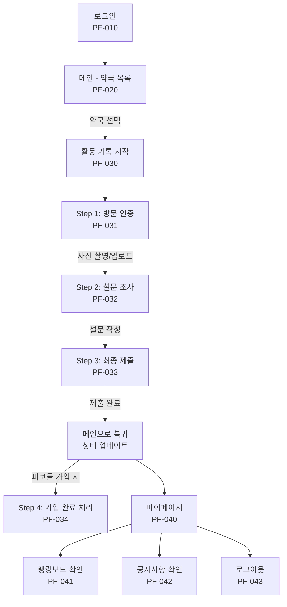
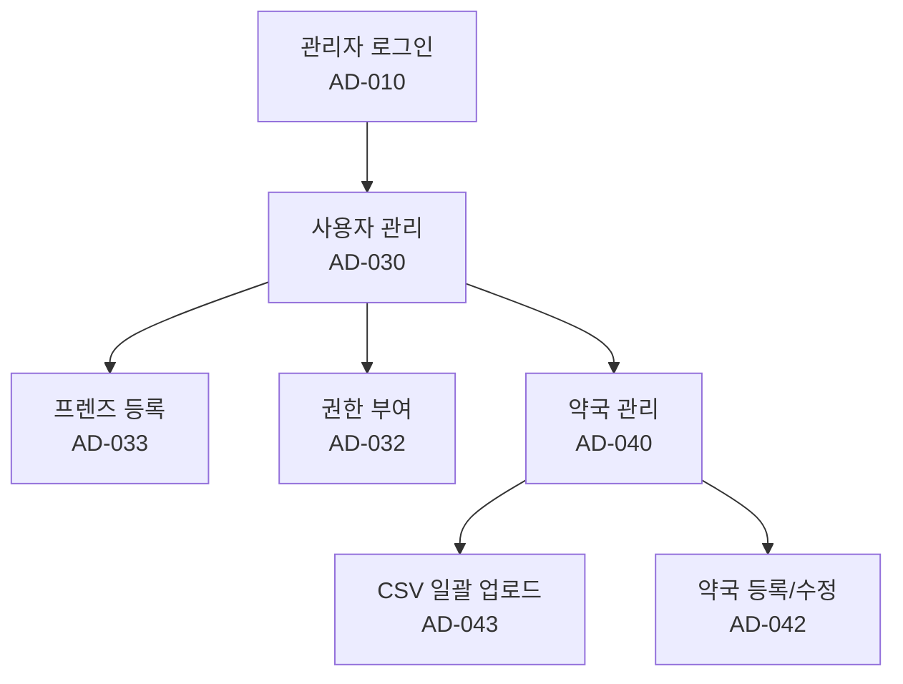
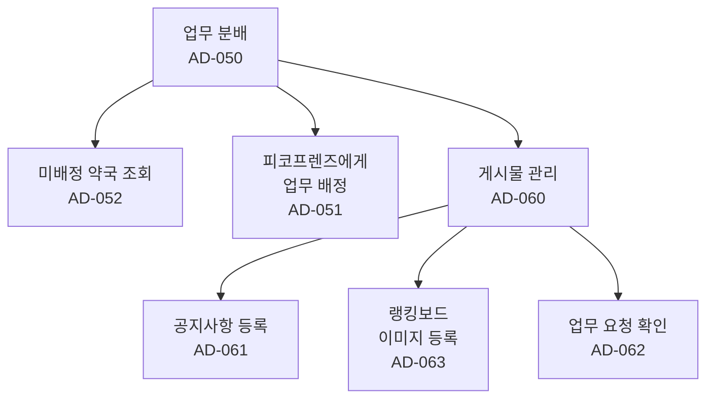
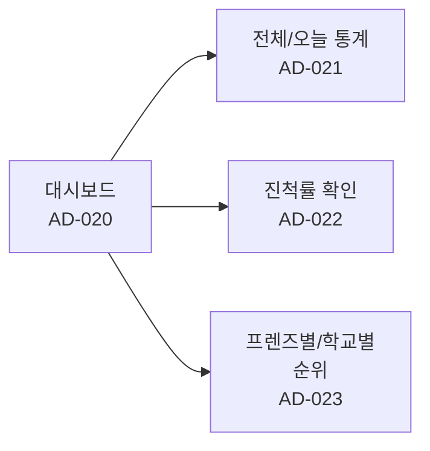
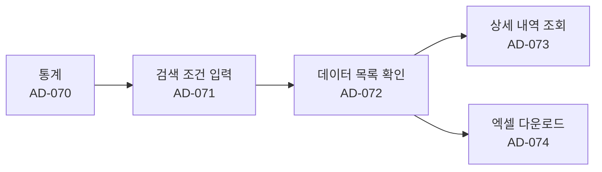

# 피코프렌즈 현장 활동 관리 시스템 - IA (Information Architecture)

## 문서 정보
- **버전**: v3.0
- **작성일**: 2025-10-27
- **작성자**: 오창엽 차장
- **프로젝트명**: 피코프렌즈 현장 활동 관리 시스템

## 버전 히스토리
| 일자 | 내용 |
|------|------|
| 2025-09-10 | 최초작성 (모바일 앱으로 기획) |
| 2025-09-23 | 수정작성 (모바일 웹으로 기획) |
| 2025-10-27 | 수정작성 (개발팀 토의 후 화면 설계 및 기능 변경) |

---

## 1. 개요

### 1.1 핵심 목표

본 시스템은 50명의 피코프렌즈가 4주간 1,600곳의 약국을 방문하여 가입을 유치하는 대규모 현장 활동을 효율적으로 관리하고, 현장에서 발생하는 귀중한 데이터(VoC)를 체계적으로 수집 및 관리하기 위한 모바일 웹 기반 시스템입니다.

**주요 목표:**
- **활동 관리 효율화**: 피코프렌즈의 약국 방문 활동을 실시간으로 관리하고, 보고 과정을 자동화하여 운영 리소스를 최소화
- **데이터 자산화**: 방문 인증, 설문 조사, 현장 피드백을 디지털 데이터로 축적하여 향후 마케팅 전략 수립 및 서비스 개선의 기반으로 활용
- **신뢰성 확보**: 사진 인증 시 현장 촬영만 허용하여 활동 데이터의 신뢰도 확보

### 1.2 주요 사용자

| 역할 | 주요 과업 |
|------|----------|
| **피코프렌즈** | 배정된 약국 목록 확인, 약국 방문 후 사진 인증, 설문 조사 제출, 현장 피드백 제출, 본인 활동 내역 조회 |
| **관리자** | 활동 현황 실시간 모니터링, 프렌즈 계정 및 방문 약국 관리/배정, 설문 문항 관리, 전체 활동 데이터 조회 및 엑셀 추출 |

---

## 2. 피코프렌즈 (사용자) IA

### 2.1 화면 ID 체계
- **접두사**: PF (PicoFriends)
- **화면 ID 범위**: PF-010 ~ PF-043

### 2.2 화면 구조

#### PF-010: 로그인

| ID | Depth 1 | Depth 2 | Depth 3 | 화면/기능 설명 | 정책/규칙 | 비고 |
|----|---------|---------|---------|----------------|-----------|------|
| PF-010 | 로그인 | | | | | |
| PF-011 | | | 아이디/PW 입력 | 관리자로부터 발급받은 계정 정보를 입력하여 로그인 | - | |
| PF-012 | | | 로그인 버튼 | 입력된 정보 검증 후 성공 시 메인 화면(PF-020)으로 이동 | | |

**기능 상세:**
- 관리자가 발급한 계정으로 시스템 접근
- 이메일 주소 및 비밀번호 입력
- 인증 실패 시 오류 메시지 표시

---

#### PF-020: 메인 (오늘의 방문 목록)

| ID | Depth 1 | Depth 2 | Depth 3 | 화면/기능 설명 | 정책/규칙 | 비고 |
|----|---------|---------|---------|----------------|-----------|------|
| PF-020 | 메인 | (오늘의 방문 목록) | | 관리자에게 배정받은 '오늘 방문할 약국' 목록을 표시하는 기본 화면 | | |
| PF-021 | | | 상태 필터 | '전체', '배정 전', '방문 완료' 상태로 목록을 필터링 | 기본값: '배정 전' | |
| PF-022 | | | 약국 리스트 | - 각 항목은 [약국명], [주소], [상태]로 구성 - '방문 전' 약국 선택 시 활동 기록(PF-030) 프로세스 시작 | 주소 터치 시 지도 앱 연동 | |

**기능 상세:**
- 관리자가 배정한 약국 목록 표시
- 약국별 정보: 약국명, 주소, 사업자번호, 연락처, 방문 상태
- 상태별 필터링 (전체, 방문 예정, 방문 완료, 가입 완료)
- 무한 스크롤 방식으로 목록 표시

---

#### PF-030: 활동 기록

| ID | Depth 1 | Depth 2 | Depth 3 | 화면/기능 설명 | 정책/규칙 | 비고 |
|----|---------|---------|---------|----------------|-----------|------|
| PF-030 | 활동 기록 | | | 약국 선택 후 진행되는 일련의 데이터 제출 과정 | | 31 → 32 → 33 순서로 진행 |
| PF-031 | | (Step 1) | 방문 인증 (사진) | - 화면 진입 시 즉시 디바이스의 카메라 앱 실행 - 약국 전경 촬영 후 '확인' 버튼으로 업로드 - 촬영한 사진을 서버로 전송 | - 갤러리 접근 절대 불가 | 신뢰도 확보 핵심 기능 |
| PF-032 | | (Step 2) | 설문 조사 | - 사진 인증 완료 후 관리자가 설정한 설문 화면으로 자동 전환 - 객관식, 주관식 등 문항에 답변 입력 | 문항은 관리자(AD-050)에서 설정 | |
| PF-033 | | (Step 3) | 최종 제출 | - '제출하기' 버튼 터치 시 모든 데이터(사진, 설문) 전송 - 성공 시 "완료" 알림 후 메인(PF-020)으로 이동 - 메인 화면에서 해당 약국 상태가 '방문 완료'로 변경 | - 중복 제출 방지 로직 필수 - 오프라인 시 임시 저장 기능 | 오프라인 기능은 후순위 |
| PF-034 | | (Step 4) | 회원 가입 | - 방문 완료 후, 약국몰 사업자번호와 자동으로 비교하여 가입 완료 처리 | | |

**활동 기록 프로세스:**

1. **Step 1: 방문 인증 (PF-031)**
   - 약국 전경 촬영 (카메라 앱 실행)
   - 갤러리 접근 차단으로 신뢰도 확보
   - 촬영 사진 업로드

2. **Step 2: 설문 조사 (PF-032)**
   - 관리자가 설정한 설문지 표시
   - 다양한 응답 유형 지원:
     - 객관식 (라디오, 체크박스)
     - 주관식 (단답형, 장문형)
   - 필수 항목 검증

3. **Step 3: 최종 제출 (PF-033)**
   - 모든 데이터 서버 전송
   - 중복 제출 방지
   - 완료 시 메인 화면으로 이동
   - 약국 상태 자동 업데이트

4. **Step 4: 회원 가입 확인 (PF-034)**
   - 사업자번호 기준 피코몰 가입 여부 확인
   - 배치 프로세스를 통한 자동 처리
   - 가입 완료 시 상태 변경

---

#### PF-040: 마이페이지

| ID | Depth 1 | Depth 2 | Depth 3 | 화면/기능 설명 | 정책/규칙 | 비고 |
|----|---------|---------|---------|----------------|-----------|------|
| PF-040 | 마이페이지 | | | | | |
| PF-041 | | | 랭킹보드 | 오늘 방문 약국수, 회원 가입 약국 수 등 내 활동과 피코프렌즈 활동 확인 | | |
| PF-042 | | | 공지사항 | 관리자가 등록한 공지사항 목록 확인 | | |
| PF-043 | | | 로그아웃 | 시스템에서 로그아웃 | | |

**기능 상세:**

1. **랭킹보드 (PF-041)**
   - 개인 활동 통계
     - 오늘 방문 약국 수
     - 회원 가입 약국 수
     - 총 방문 약국 수
     - 방문율
   - 전체 피코프렌즈 랭킹 (1~10위)
   - 순위 변동 표시 (▲, ▼, -, NEW)
   - 점수 산정 기준:
     - 방문: 10점/건
     - 회원가입: 100점/건

2. **공지사항 (PF-042)**
   - 관리자 등록 공지사항 목록
   - 롤링 배너 (최근 3개, 10초 간격)
   - 클릭 시 상세 내용 팝업

3. **로그아웃 (PF-043)**
   - 세션 종료 및 로그인 화면 이동

---

### 2.3 사용자 플로우 요약

---

## 3. 피코프렌즈 (관리자) IA

### 3.1 화면 ID 체계
- **접두사**: AD (Admin)
- **화면 ID 범위**: AD-010 ~ AD-074

### 3.2 화면 구조

#### AD-010: 로그인

| ID | Depth 1 | 화면/기능 설명 |
|----|---------|----------------|
| AD-010 | 로그인 | 관리자 계정으로 시스템 접근 |

---

#### AD-020: 대시보드

| ID | Depth 1 | Depth 2 | Depth 3 | 화면/기능 설명 | 정책/규칙 | 비고 |
|----|---------|---------|---------|----------------|-----------|------|
| AD-020 | 대시보드 | | | | | |
| AD-021 | | | 전체/오늘 | [전체] 약국방문, 회원가입, 전환율 (전체 기준) [오늘] 약국방문, 회원가입, 전환율 (당일 기준) | 피코프렌즈 전체 대상 전환율(%) = (약국 가입 수 ÷ 전체 방문 수) × 100 | |
| AD-022 | | | 전체 진척률 | 피코프렌즈 전체 인원 통계 그래프 - 약국 방문, 회원가입 기준 막대/띠 그래프 - 일자, 주차, 월간 조회 | 진척률(%) = (현재일까지 계획된 작업량 ÷ 프로젝트 전체 작업량) × 100 | |
| AD-023 | | | 프렌즈별 활동 순위 | 피코프렌즈별 성과 랭킹 | | |
| AD-023 | | | 학교별 성과 | 소속 학교별 활동 성과 통계 | | |

**기능 상세:**
- 실시간 활동 현황 모니터링
- 주요 KPI 지표:
  - 총 방문 수
  - 총 회원가입 수
  - 방문율 및 전환율
- 시각화 차트:
  - 일별/주별/월별 추이 그래프
  - 피코프렌즈별 성과 비교
  - 학교별 성과 비교

---

#### AD-030: 사용자 관리

| ID | Depth 1 | Depth 2 | Depth 3 | 화면/기능 설명 | 정책/규칙 | 비고 |
|----|---------|---------|---------|----------------|-----------|------|
| AD-030 | 사용자 관리 | | | | | |
| AD-031 | | | 프렌즈 목록 조회 | 등록된 모든 프렌즈의 목록 (이름, ID, 총 배정수, 완료수 등) | | |
| AD-032 | | | 권한 부여/수정 | 뷰어, 관리자, 피코프렌즈 | | |
| AD-033 | | | 프렌즈 등록/수정 | 신규 프렌즈 계정 생성 및 기존 정보 수정 | | |

**기능 상세:**
- 피코프렌즈 계정 관리 (CRUD)
- 역할 및 권한 설정:
  - 뷰어 (Viewer): 조회만 가능
  - 피코프렌즈 (PicoFriends): 현장 활동 수행
  - 관리자 (Admin): 전체 관리
- 활동 통계 조회 (배정수, 완료수)
- 상태 관리 (PENDING, ACTIVE, INACTIVE)

---

#### AD-040: 약국 관리

| ID | Depth 1 | Depth 2 | Depth 3 | 화면/기능 설명 | 정책/규칙 | 비고 |
|----|---------|---------|---------|----------------|-----------|------|
| AD-040 | 약국 관리 | | | | | |
| AD-041 | | | 약국 목록 조회 | 시스템에 등록된 전체 약국 DB 목록, 히스토리 | | |
| AD-042 | | | 약국 등록/수정 | 신규 약국 등록 및 수정 | | |
| AD-043 | | | CSV 일괄 업로드 | - 제공된 템플릿 양식에 맞춰 대량의 약국 정보를 한번에 등록 - 등록 및 프렌즈 배정 동시 진행 가능 | - 템플릿 제공 필수 - 오류 데이터 발생 시 처리 방안 정의 필요 | 1,600곳 데이터 관리 핵심 |
| AD-044 | | | 약국 정보 조회 | 약국 방문 히스토리 확인 | | |

**기능 상세:**
- 약국 데이터베이스 관리 (CRUD)
- 약국 정보:
  - 약국명, 사업자번호
  - 주소, 연락처
  - 담당 피코프렌즈
  - 방문 상태 (미방문, 방문완료, 가입완료)
- CSV 일괄 업로드:
  - 템플릿 다운로드
  - 대량 데이터 등록
  - 오류 검증 및 처리
- 약국 변경 이력 추적
- 방문 히스토리 조회

---

#### AD-050: 업무 분배

| ID | Depth 1 | Depth 2 | Depth 3 | 화면/기능 설명 | 정책/규칙 | 비고 |
|----|---------|---------|---------|----------------|-----------|------|
| AD-050 | 업무 분배 | | | | | |
| AD-051 | | | 약국 업무 분배 | 약국 관리에서 생성된 약국을 사용자에게 업무 분배 | | |
| AD-052 | | | 약국 업무 조회 | 배정, 미배정, 전체 업무 조회 가능 | | |
| AD-053 | | | 약국 정보 조회 | 약국 방문 히스토리 확인 | | |

**기능 상세:**
- 약국-피코프렌즈 배정 관리
- 배정 현황 조회:
  - 전체 약국 수
  - 배정된 약국 수
  - 미배정 약국 수
- 일괄 배정 기능
- 배정 해제 및 재배정
- 피코프렌즈별 업무량 조절

---

#### AD-060: 게시물 관리

| ID | Depth 1 | Depth 2 | Depth 3 | 화면/기능 설명 | 정책/규칙 | 비고 |
|----|---------|---------|---------|----------------|-----------|------|
| AD-060 | 게시물 관리 | | | | | |
| AD-061 | | | 공지사항 | 피코프렌즈에게 노출될 공지사항을 등록, 수정, 삭제 | | |
| AD-062 | | | 업무요청 | 피코프렌즈가 업무가 없을 시 요청하는 게시글 | | |
| AD-063 | | | 랭킹보드 | 랭킹보드에 들어가는 이미지 등록 | | |

**기능 상세:**

1. **공지사항 (AD-061)**
   - 공지사항 작성/수정/삭제
   - 리치 텍스트 에디터
   - 이미지 첨부
   - 노출 여부 설정
   - 조회 수 추적

2. **업무요청 (AD-062)**
   - 피코프렌즈의 업무 요청 게시글 확인
   - 요청 승인/거부
   - 업무 분배로 연계

3. **랭킹보드 이미지 관리 (AD-063)**
   - 랭킹보드 배경 이미지 등록
   - 이미지 미리보기
   - 활성화/비활성화

---

#### AD-070: 통계

| ID | Depth 1 | Depth 2 | Depth 3 | 화면/기능 설명 | 정책/규칙 | 비고 |
|----|---------|---------|---------|----------------|-----------|------|
| AD-070 | 통계 | | | | | |
| AD-071 | | | 상세 검색/필터 | 기간, 프렌즈, 약국명 등 다양한 조건으로 데이터 검색 및 필터링 | | |
| AD-072 | | | 데이터 목록 | 조건에 맞는 활동 데이터 목록을 표시 (제출자, 약국, 제출일시 등) | | |
| AD-073 | | | 상세 보기 | 특정 활동 건 클릭 시, 제출된 인증 사진 원본, 설문 등 확인 | | |
| AD-074 | | | 엑셀 다운로드 | 현재 필터링된 결과를 기준으로 모든 데이터를 CSV 파일로 추출 | - 다운로드 시 파일명 규칙 정의 (예: pico_friends_data_250923.csv) | 보고 및 분석 핵심 기능 |

**기능 상세:**

1. **상세 검색/필터 (AD-071)**
   - 검색 조건:
     - 기간 (시작일~종료일)
     - 피코프렌즈 (개인/학교별)
     - 약국명/주소
     - 방문 상태
   - 복합 검색 지원

2. **데이터 목록 (AD-072)**
   - 페이지네이션
   - 정렬 기능 (날짜, 이름 등)
   - 목록 항목:
     - 제출자 (피코프렌즈)
     - 약국명
     - 제출일시
     - 방문 상태

3. **상세 보기 (AD-073)**
   - 방문 인증 사진 원본 보기
   - 설문 조사 답변 전체
   - 제출 메타데이터

4. **엑셀 다운로드 (AD-074)**
   - CSV 형식 데이터 추출
   - 필터링된 결과 기준 다운로드
   - 파일명 규칙:
     - pico_friends_data_YYMMDD.csv
   - 포함 데이터:
     - 피코프렌즈 정보
     - 약국 정보
     - 방문일시
     - 설문 답변
     - 방문 상태

---

### 3.3 관리자 플로우 요약

#### Phase 1: 시스템 준비 (초기 설정)

#### Phase 2: 업무 배분 및 운영

#### Phase 3: 실시간 모니터링

#### Phase 4: 성과 분석 및 보고

---

## 4. 기능 명세 요약

### 4.1 피코프렌즈 기능

| 기능 | 상세 설명 |
|------|-----------|
| **메인 (약국 목록 조회)** | - 관리자로부터 배정받은 '오늘의 방문 약국' 리스트 확인 - 각 항목은 [약국명], [주소], [상태(방문 전/방문 완료/가입 완료)] 포함 - '방문 전' 상태의 약국을 선택하여 활동 시작 |
| **방문 인증 (사진)** | - 약국 선택 시, 사진 촬영 화면으로 이동 - 디바이스의 카메라를 직접 실행하여 촬영 후 업로드 - 신뢰도 확보를 위해 갤러리 접근 차단 |
| **설문 조사 제출** | - 사진 인증 후, 관리자가 설정한 설문조사 화면으로 자동 전환 - 객관식, 주관식 등 다양한 형태의 질문에 답변 입력 |
| **활동 내역 확인** | - 본인이 제출 완료한 활동 내역(방문 약국, 시간, 제출 데이터) 조회 |
| **오프라인 데이터 (임시저장)** | - 인터넷 연결이 불안정한 경우, 입력한 데이터(텍스트, 설문)를 디바이스 내에 임시 저장 - 온라인 전환 시, 저장된 데이터를 자동으로 서버에 전송하는 기능 |

### 4.2 관리자 기능

| 기능 | 상세 설명 |
|------|-----------|
| **대시보드** | - 전체 프렌즈의 활동 현황을 실시간 모니터링 - 주요 지표(총 방문 수, 누적 달성률, 개인별 진척도 등)를 그래프 등 시각 자료로 제공 |
| **프렌즈/약국 관리** | - 프렌즈 계정 생성 및 정보 수정, 방문 약국 리스트 배정 - CSV 파일 일괄 업로드를 통한 대량 약국 정보 등록 및 배정 기능 필수 |
| **설문 관리** | - 피코프렌즈가 현장에서 진행할 설문 문항을 생성, 수정, 삭제 |
| **데이터 조회 및 추출** | - 제출된 모든 활동 데이터(사진, 설문 답변, 피드백)를 조건별로 검색 및 필터링 - 조회된 모든 데이터를 엑셀(CSV) 파일로 다운로드하는 기능 필수 |

---

## 5. 비기능적 요구사항

### 5.1 성능
- 페이지 로딩 시간: 3초 이내
- 데이터 제출 응답 시간: 5초 이내

### 5.2 보안
- 모든 통신 구간은 HTTPS(SSL/TLS)로 암호화
- SQL Injection, XSS 등 주요 웹 취약점 방어 로직 적용
- 사용자 개인정보(계정, 연락처 등)는 암호화하여 저장
- 사용자 역할에 따른 명확한 접근 권한 제어 및 데이터 접근 로그 기록

### 5.3 확장성
- 향후 사용자 및 데이터 증가에 유연하게 대응할 수 있는 클라우드(AWS, GCP 등) 기반으로 설계
- 트래픽 증가에 따른 서버 자원 자동 확장(Auto-scaling) 정책 고려

### 5.4 데이터 관리
- 데이터의 무결성을 보장하며, 정기적인 데이터베이스 백업 및 복구 정책 수립
- 데이터 보관 주기 및 파기 정책 정의

### 5.5 예외 처리
- **사진 인증 실패**: 조도 부족, 흔들림 등으로 사진 판독이 어려운 경우, 재촬영을 안내하거나 수동 승인 요청 프로세스 마련
- **중복 제출 방지**: 네트워크 오류 등으로 인한 중복 데이터가 저장되지 않도록 서버단에서 처리

---

## 6. 개발 우선순위

### ① 필수 기능 (Phase 1)
- 피코프렌즈: 로그인, 약국 목록 조회, 방문 인증(사진/위치), 설문/피드백 제출 기능
- 관리자: 계정/약국 관리(CSV 포함), 데이터 조회 및 엑셀 추출 기능

### ② 고도화 (Phase 2)
- 대시보드 시각화
- 피코프렌즈 활동 내역 상세 조회
- 오프라인 임시 저장 기능

### ③ 확장 (Phase 3)
- 사용자간 커뮤니케이션 기능
- 실시간 알림 (WebSocket, FCM)
- AI 기반 데이터 분석

---

## 7. 화면 ID 전체 목록

### 피코프렌즈 (사용자)
- PF-010: 로그인
- PF-011~012: 로그인 컴포넌트
- PF-020: 메인 (오늘의 방문 목록)
- PF-021~022: 메인 컴포넌트
- PF-030: 활동 기록
- PF-031~034: 활동 기록 단계별 화면
- PF-040: 마이페이지
- PF-041~043: 마이페이지 컴포넌트

### 관리자
- AD-010: 로그인
- AD-020~023: 대시보드 및 컴포넌트
- AD-030~033: 사용자 관리
- AD-040~044: 약국 관리
- AD-050~053: 업무 분배
- AD-060~063: 게시물 관리
- AD-070~074: 통계

---

**문서 버전**: 3.0
**최종 수정일**: 2025-10-27
